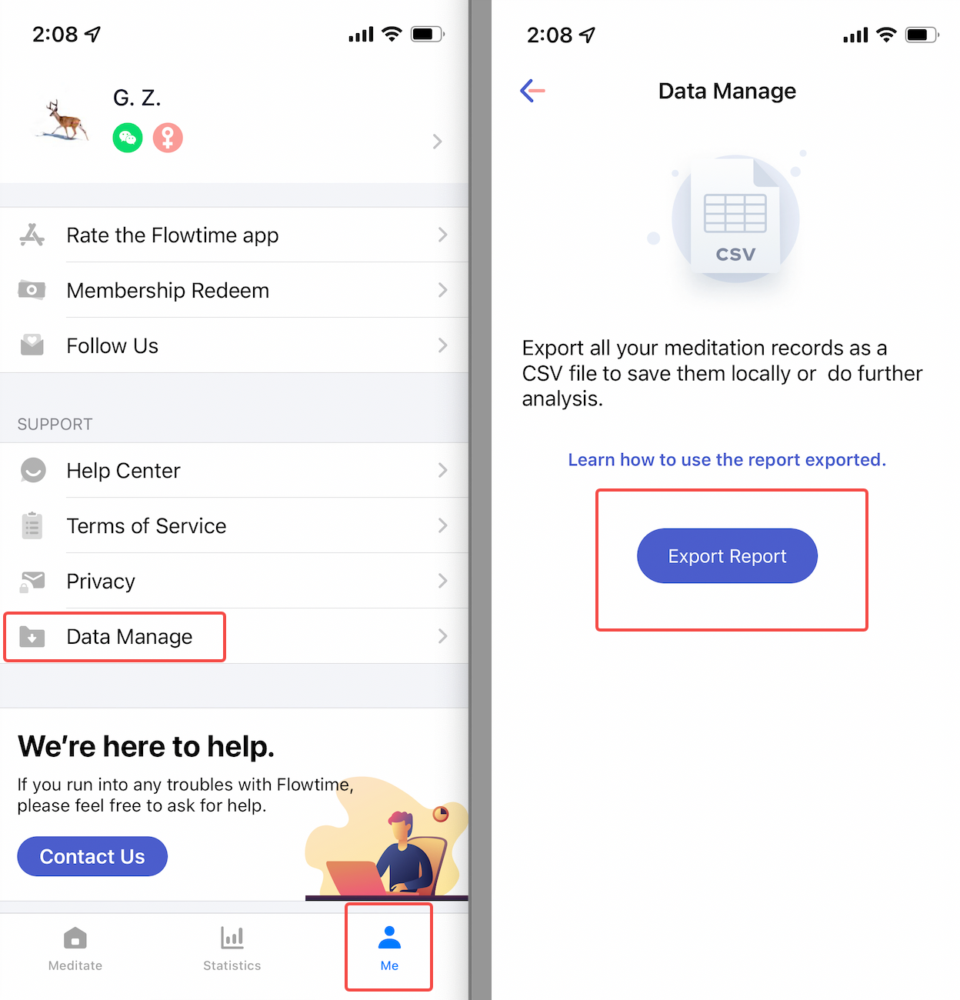
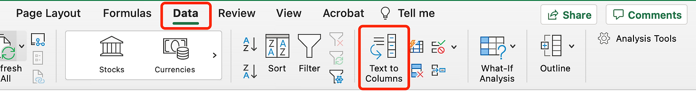
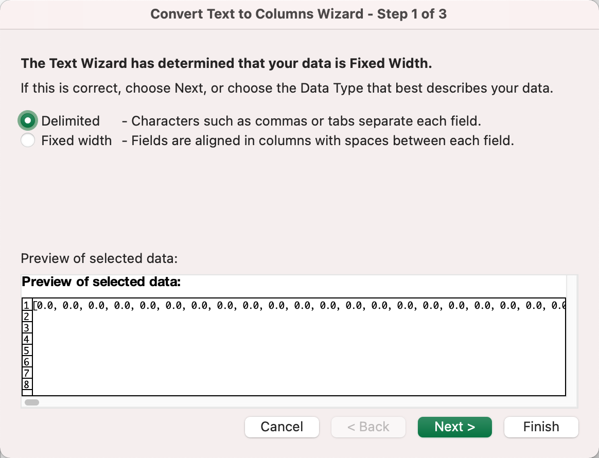
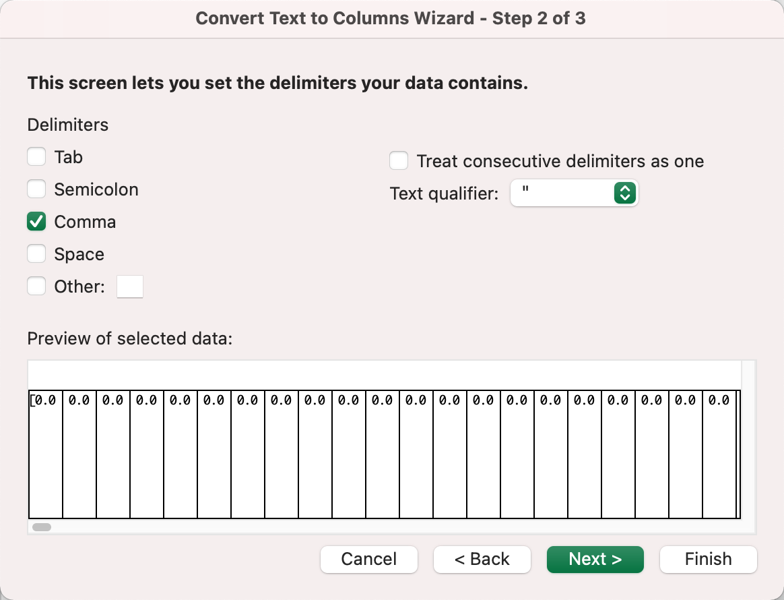
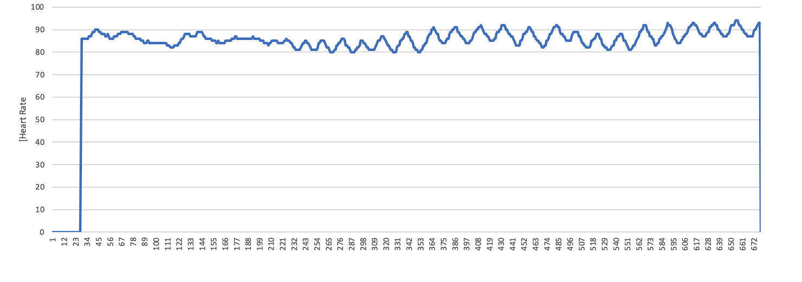

## A quick guide to using the report exported

#### How to export all raw data as a CSV file?

Go to the bottom of Me. Find Data Manager.
The report you export will include all your medication records and you could do further data analysis as you wish.

#### How to use the raw data to draw a chart?
Take the heart rate part for example. You could see the maximum, minimum, and average heart rate during one session. Also, you could see the "raw_data" column which allows you to plot charts as you see in the app. The raw data is list-type data, such as heart rate raw data  [78,78,81,...,79,83]. 

Follow the steps below and you could achieve that!

1. Choose the list-type data and use **"Text to columns"** in **"Microsoft Excel- Data"** to convert text to columns for further data analysis.

2. Select **"Delimited"** and click Next

3. Select **"Comma"** and click Next

4. Then you can use the data to draw a chart

#### Data changelog

As we update the app, some data you see in the report has been added or changed. So you may find the data styles in the exported file vary over time.  Below is the changelog: 

Date: 08/20/2021

App Version: 3.3.0

* [What is Heart Rate Variability?]
- HRV value calculation method changed. [Learn more](/Glossary/What-is-Heart-Rate-Variability(HRV)).

-  Changed the time interval of the x-axis of the HRV report graph from 0.2s to 0.6s.
---

Date: 01/05/2021

App Version:  2.0.0

- New fields added: session_id, app_version, meditation_goal, meditation_time, coherence_goal, coherence_time.

- Added Breath Coherence graph.

- Time interval:

  - Changed the time interval of the x-axis of the Brainwave Rhythms report graph from 0.4s to 0.6s. 

  - Changed the time interval of the x-axis of the Heart Rate report graph from 0.2s to 0.6s. 

  - Changed the time interval of the x-axis of  Attention & Relaxation, Pressure report graph from 0.8s to 0.6s.
---
Date: 12/07/2020

App Version:  1.5.1

Added the Feeling and Diary.

---
Date: 11/24/2020

App Version:  1.5.0

- Changed the Brainwave Rhythms report graph from a percentage value to an absolute value. 

- Changed the display form of the graph from an area graph to a line graph.

