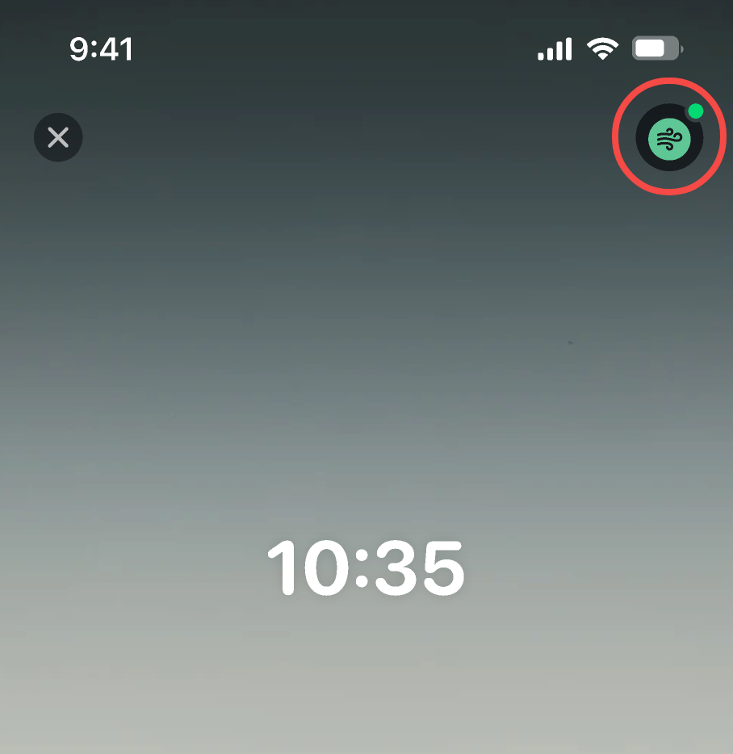
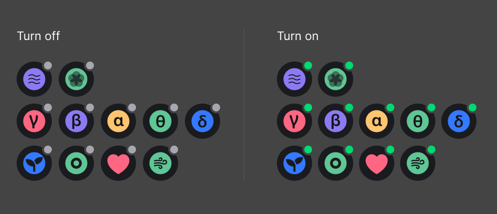
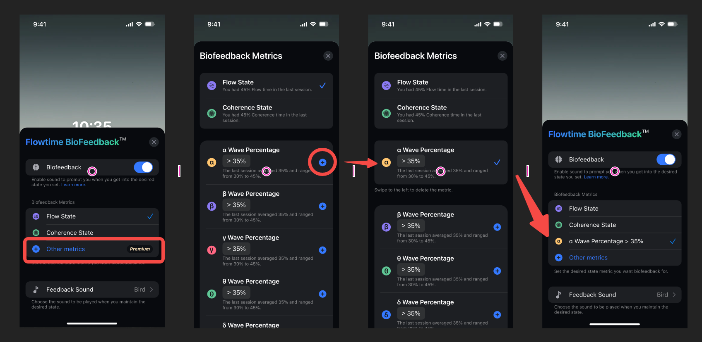
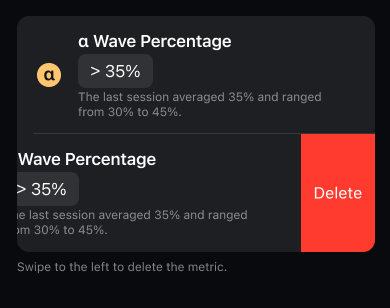
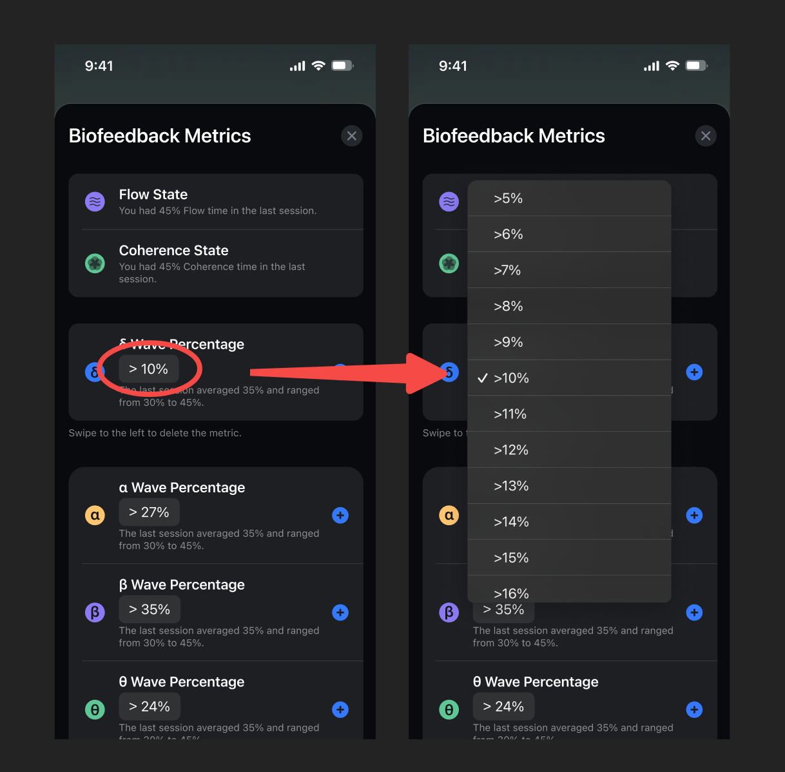

## How to set biofeedback?

### Where to turn it on/off?

After connecting the device and starting a session, you can see the Biofeedback status in the upper right corner.

Different icons correspond to different feedback metrics, each with an icon. Each icon has two states, representing whether biofeedback is on or off. 

Tapping on the icon will take you to the Biofeedback settings.

### Add and set metrics

#### Add and select a metric

Tap + to add another metric you aim to have biofeedback training. After adding it, tap the metric option to select it.

#### Delete a metric

Swipe left to delete a metric. Flow and coherence biofeedback can't be deleted.

#### Set a metric

In each metric, you can set the biofeedback threshold. The default threshold is recommended based on the data distribution of all users. We also provide the range and average from your most recent sessions as a reference.

All metrics and indications are shown in the following table:

|          Category         |       Metric      | Default|     Range   |              Note             |
|:-------------------------:|:-----------------:|:------:|:-----------:|:-----------------------------:|
|           Goals           |        Flow       |        |             |           |
|                           |     Coherence     |        |             |           |
| Brainwave Rhythms(Premium)|         α         |  ＞27% |    10~40%   |           | 
|                           |         β         |  ＞35% |    20~60%   |           |
|                           |         θ         |  ＞24% |    10~40%   |           | 
|                           |         δ         |  ＞10% |    5~20%    |           | 
|                           |         γ         |  ＞10% |    5~30%    |           |              
|      Moods(Premium)       |     Attention     |  ＞75  |    1~100    |  Low：0-29，Medium：30-69，High：70-100  |
|                           |     Relaxation    |  ＞75  |    1~100    |  Low：0-29，Medium：30-69，High：70-100  |
|      Biodata(Premium)     |     Heart Rate    |  ＜65  |    40~120   |  bpm                                    |
|                           |  Respiratory Rate |  ≤ 6   |     4~8     |  breath/min                             |

### How does it work?
When you practice, you will hear the biofeedback sound if you reach your desired status.

For example, if your desired state is when your heart rate is lower than 65, and you would like to hear it every 5 seconds, set Heart Rate ＜65 and interval 5s. The sound will play when your heart rate decreases and falls below 65. If you can keep it there, you'll hear the sound every 5 seconds. When your heart rate >= 65, the sound will not ring.