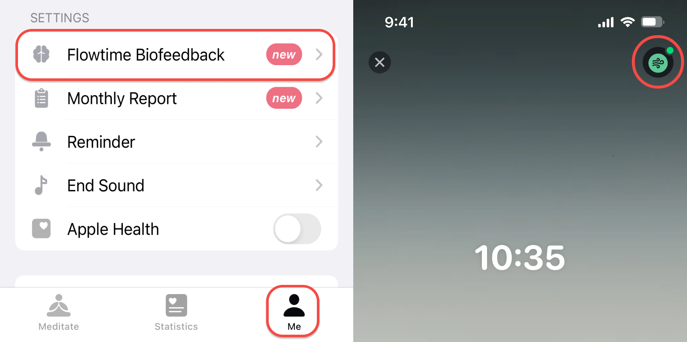
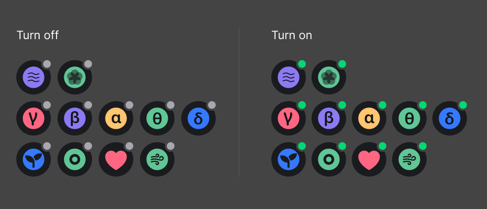
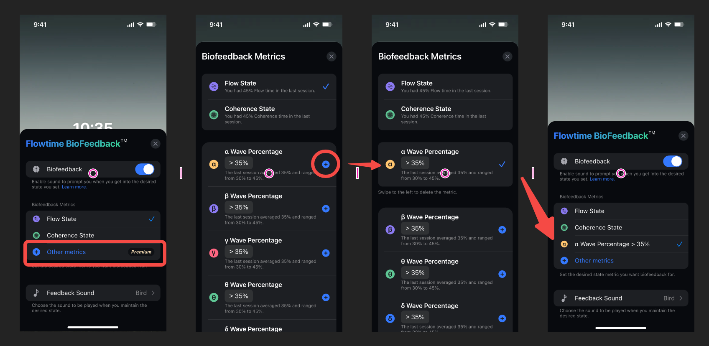
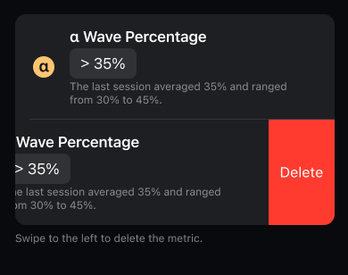
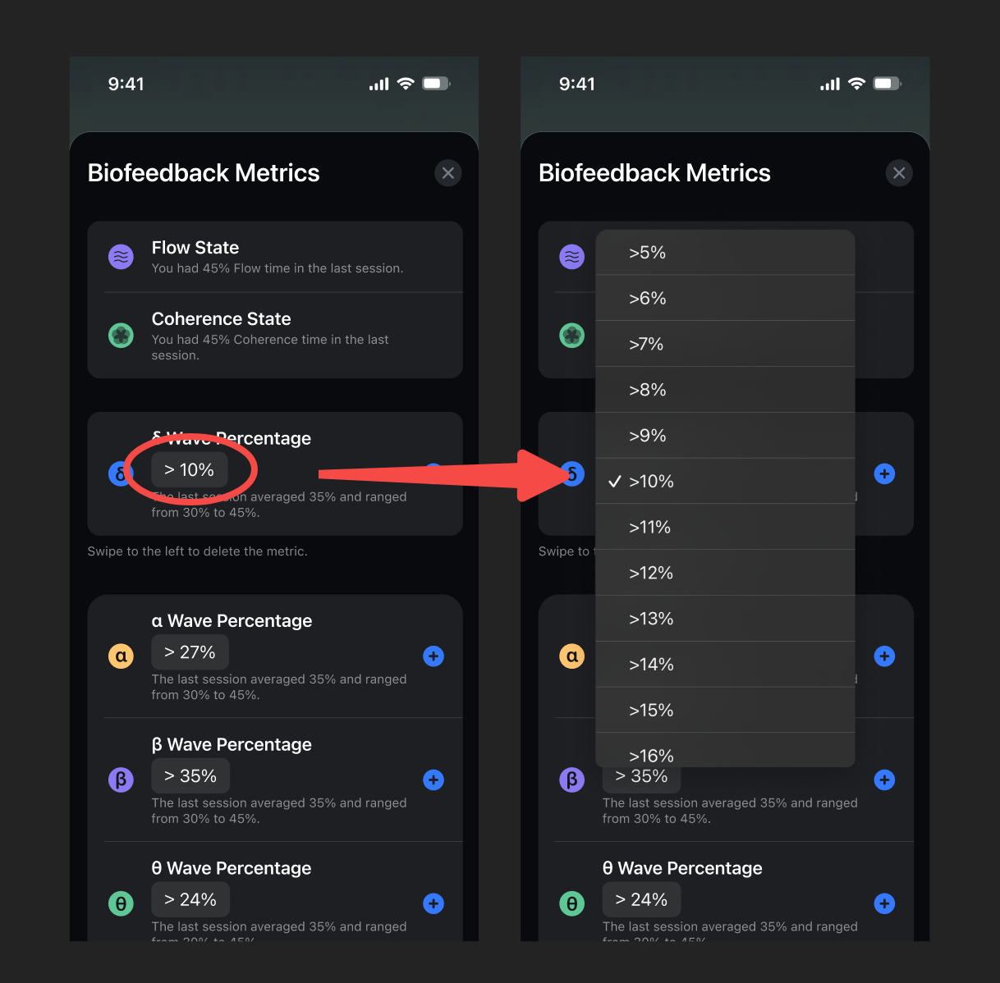

## What is Biofeedback?

Biofeedback is a way to help you take control of your body by providing you with real-time feedback on your physiological state.

As we all know, meditation has many benefits. It can help us focus more and achieve deep relaxation. We recommend focusing on one goal at a time in your daily practice. By setting a specific and measurable goal that allows for timely feedback, you can more easily perceive and optimize the effects of each practice.

You can choose one of the provided metrics as your practice goal and select a sound that you enjoy as a reward for achieving the desired state and duration. For example, if you choose "bell" as the feedback sound with "5s" as the feedback interval, you will hear a "bell" sound when you reach the "Flow" state after 5 seconds. If you're still in the state of "flow" after 5 seconds, you will hear the sound again.

This way, you can train your mind and body to enter and maintain a state of harmony and balance while enjoying the pleasant sounds. Biofeedback meditation is a powerful tool for enhancing your well-being and performance. We hope you find this helpful in your practice!

#### Metrics you can set

|      Flowtime Headband      | Flowtime Cushion | 
|:--------------:|:---------:|
| Flow|Coherence|
|Brainwave Rhythms: α, β, θ, δ, γ （premium）|Heart Rate （premium）|
|Attention （premium）|Respiratory Rate （premium）|
|Relaxation （premium）|
|Coherence|
|Heart Rate（premium）|

### Settings
Available biofeedback sound: bell, bowl, chime, block.
Feedback interval: 5-30s.

## How to set biofeedback?

### Where to turn it on/off?

Before you start a session, you can go to Me - Flowtime Biofeedback to turn it on or off. You can also set the metrics, sounds, and intervals.

After connecting the device and starting a session, you can see the Biofeedback status in the upper right corner. Tapping the icon will take you to the Biofeedback setting page to make a change.

Different icons correspond to different feedback metrics, each with an icon. Each icon has two states, representing whether biofeedback is on or off. 

### Add and set metrics

#### Add and select a metric

Tap + to add another metric you aim to have biofeedback training. After adding it, tap the metric option to select it.

#### Delete a metric

Swipe left to delete a metric. Flow and coherence biofeedback can't be deleted.

#### Set a metric

In each metric, you can set the biofeedback threshold. The default threshold is recommended based on the data distribution of all users. We also provide the range and average from your most recent sessions as a reference.

All metrics and indications are shown in the following table:

|          Category         |       Metric      |             Note             |
|:-------------------------:|:-----------------:|:-----------------------------:|
|           Goals           |        Flow       |           |
|                           |     Coherence     |           |
| Brainwave Rhythms(Premium)|         α         |           | 
|                           |         β         |           |
|                           |         θ         |           | 
|                           |         δ         |           | 
|                           |         γ         |           |              
|      Moods(Premium)       |     Attention     |  Low：1-29，Medium：30-69，High：70-100  |
|                           |     Relaxation    |  Low：1-29，Medium：30-69，High：70-100  |
|      Biodata(Premium)     |     Heart Rate    |  bpm                                    |
|                           |  Respiratory Rate |  breath/min                             |

### How does it work?
When you practice, you will hear the biofeedback sound if you reach your desired status.

For example, if your desired state is when your heart rate is lower than 65, and you would like to hear it every 5 seconds, set your Heart Rate ＜65 and interval 5s. The sound will play when your heart rate decreases and falls below 65. If you can keep it there, you'll hear the sound every 5 seconds. When your heart rate >= 65, the sound will not ring.
