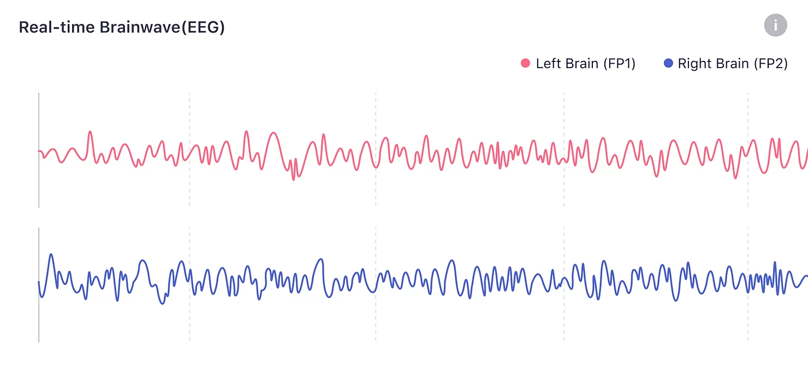
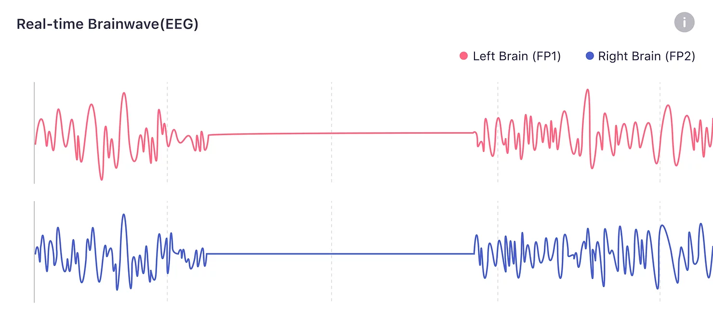
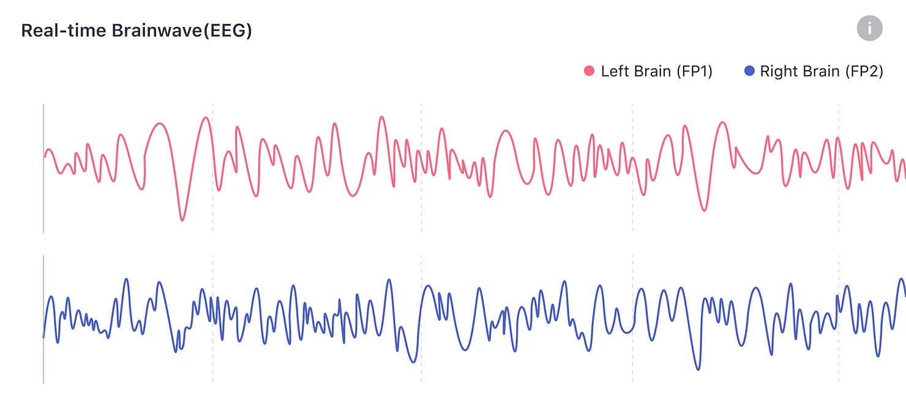

## What is Brainwave(EEG)?

Brainwaves, also known as EEG (Electroencephalography), are produced by synchronized electrical pulses from masses of neurons communicating with each other. These subtle signals are detected by the sensors placed on your forehead on the inner side of the Flowtime headband. Flowtime collects the data and extracts the valid signals to make the real-time brainwave that reflects the change of brain states.[^1]

:::note
After you put on the headband, it takes some time to finish calibration (if the skin is dry, it may take longer, about 30s to 1 min). During this time, you may also see the real-time brainwaves, but not stable due to too much noise. After that, you'll see the consistent real-time brainwaves.
:::

:::tip
For a better experience, a small amount of Electrooculography (EOG) is included in the brainwave data, so you will see real-time brainwave changes accordingly when you blink,  move your eyes, or have other facial movements. But too many facial movements like grinding your teeth will make too much noise for brainwave analysis, which will result in a flat line of the real-time brainwave.
:::

When the headband is worn correctly, there will be a small fluctuation.

When there is too much noise, real-time brainwaves turn to be a flat line.

When you blink or move your eyes, there will be a relatively significant fluctuation.

[^1]:Sanei, Saeid & Chambers, Jonathon. (2007). EEG signal processing. 10.1002/9780470511923.
