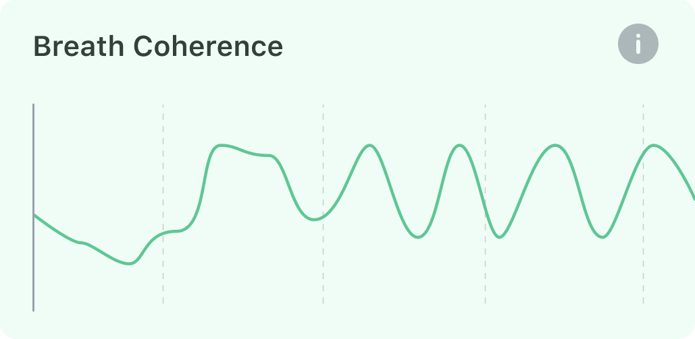

## What is Breath Coherence

Breathing patterns affect the pattern of heart rate variability [^1]. When you are doing slow and regular deep breathing, like inhalation for 5 seconds and exhalation for 5 seconds, marked by a highly ordered, smooth pattern of heart rate variability, the sympathetic and parasympathetic nervous systems can be synchronized with each other. We name this state **Breath Coherence / Coherence Time.**

At this time, the two branches of the autonomic nervous system (ANS), the sympathetic and parasympathetic nervous systems, are coordinating with each other, and you are achieving a state of cognitive enhancement and energetic calm. This state is associated with increased concentration, fast reaction, memory, and emotional stability [^2][^3]

[^1]: Courtney, Rosalba & Cohen, Marc & Dixhoorn, Jan. (2011). Relationship Between Dysfunctional Breathing Patterns and Ability to Achieve Target Heart Rate Variability With Features of "Coherence" During Biofeedback. Alternative therapies in health and medicine. 17. 38-44. 
[^2]:McCraty, Rollin. (2005). Enhancing Emotional, Social, and Academic Learning With Heart Rhythm Coherence Feedback. Biofeedback and Self-Regulation. 33. 130-134. 
[^3]:Edwards, Stephen. (2014). Evaluation of heart rhythm coherence feedback training on physiological and psychological variables. South African journal of psychology = Suid-Afrikaanse tydskrif vir sielkunde. 2014. 73– 82. 10.1177/0081246313516255.

