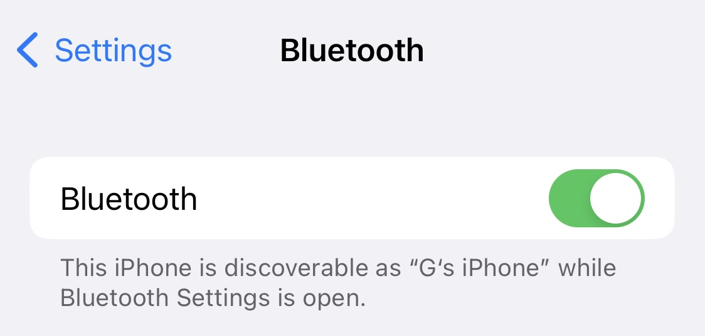
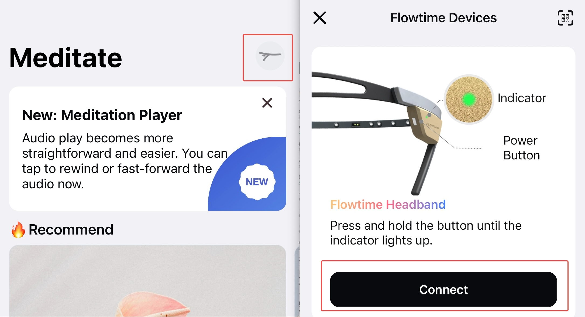
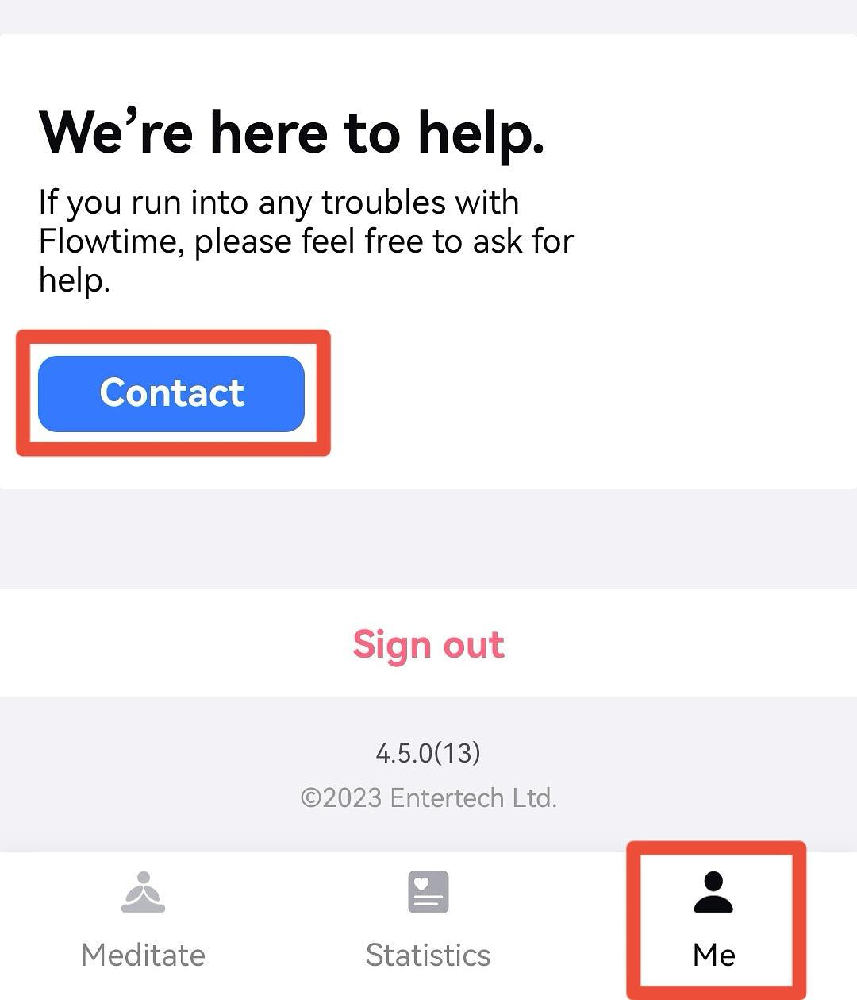

## Can't connect headband to the app after firmware update.

After you update the headband firmware, if you find that the app can't find or connect to your headband anymore, please follow the steps below to fix that.

1. Open the Settings app on your phone and tap on Bluetooth.
2. Turn off the Bluetooth switch and wait for 10 seconds.
3. Turn on the Bluetooth switch again and make sure it is enabled.
   
4. Turn on the headband and the indicator flashes blue.
5. Open the app, tap the top right corner to connect the headband.
6. When the headband is connected with the app, the indicator turns solid blue.
   

We apologize for any inconvenience this issue may have caused you.
If you have any questions or feedback, please contact our customer support team by going to Me-Contact us.
    

Thank you for choosing our headband as your meditation companion!