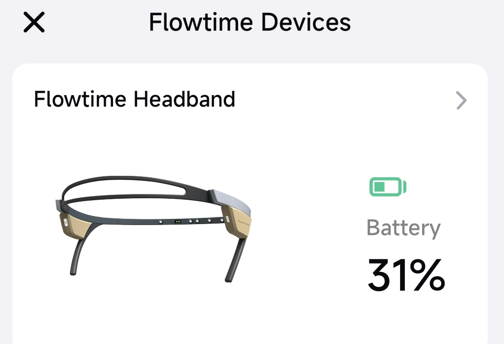

## How do I know the battery status?

#### From the indicator

|  Indicator | Battery Status |
|---|---|
| Blue light | Normal |
| Red light | Low battery  (less than 20%) |
| Red breathing light | Charging |
| Green light | Fully charged |

#### In the app

