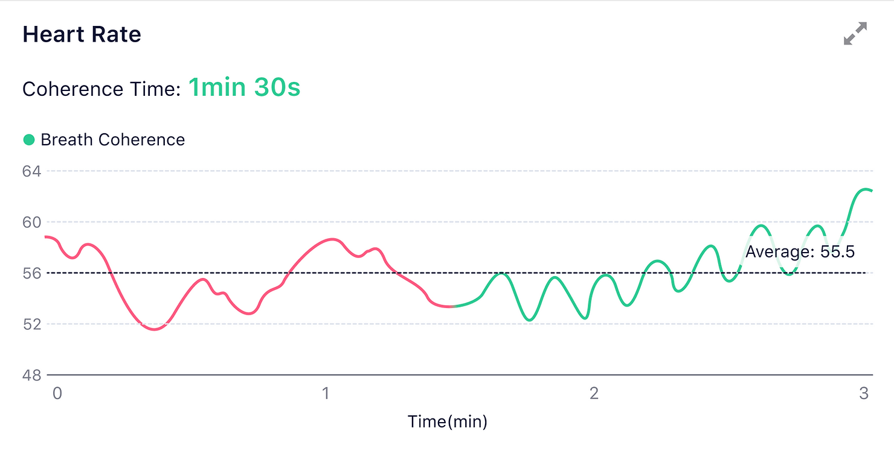

## How to understand Breath Coherence Graph?

Coherence is related to the breathing pattern during meditation. Regular deep breathing exercises (5 seconds of inhalation and 5 seconds of exhalation) can synchronize the two branches of the autonomic nervous system (ANS), the sympathetic nervous system and the parasympathetic nervous system:

1. to promote the effective functioning of the physiological system and the improvement of cognitive function;

2. to achieve the balance of your mind and body. 

Long-term breathing exercises make it easier to enter a state of coherence and maintain a high level.

#### Heart Rate & Coherence
The breathing pattern during meditation affects the pattern of heart rate changes. Slow, regular deep breathing (5 seconds of inhalation and 5 seconds of exhalation) synchronizes the sympathetic and parasympathetic nervous systems, increasing the different physiological systems' resonance.

The curve of heart rate can visually reflect the harmonious state during meditation. The heart rate change in the general form is disorderly, but the heart rate can show a periodic rhythm through regular deep breathing.

#### Coherence changes before and after breathing exercises in meditation
Coherence increases and remains high when breathing regularly in the second half.

The red part means you breathed disorderly changes, while the green part means you were having regular deep breathing

