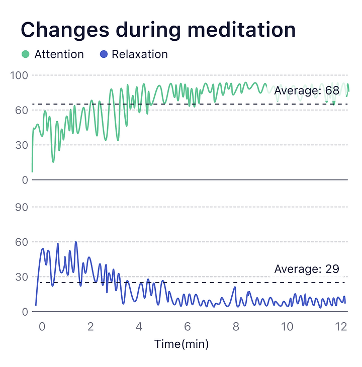

## How to understand Attention & Relaxation graph?

By monitoring Relaxation and Attention indexes at the same time, you'll have a better insight into your meditation state.

For people who have not undergone long-term meditation training, the brainwave spectrum is more concentrated in specific states. When you are focused, the Relaxation value is generally low, and when you are relaxed, the Attention value is low.  Attention and Relaxation are mutually exclusive.

