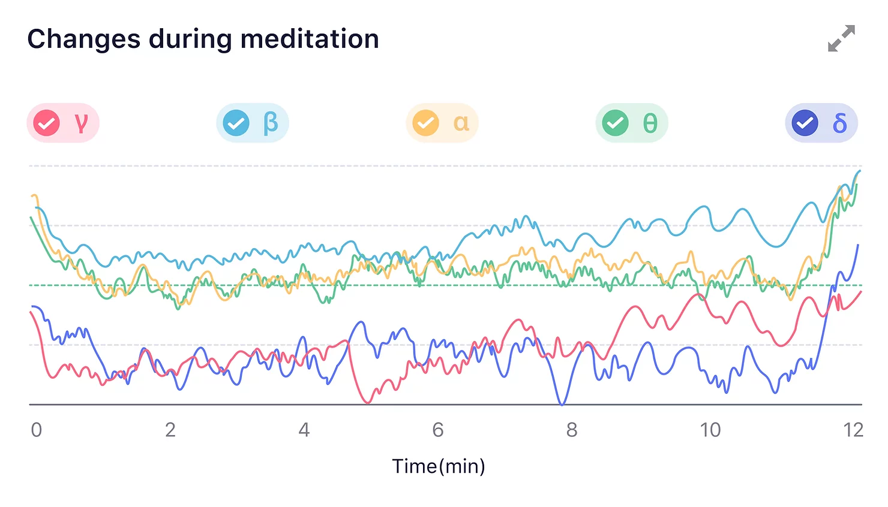
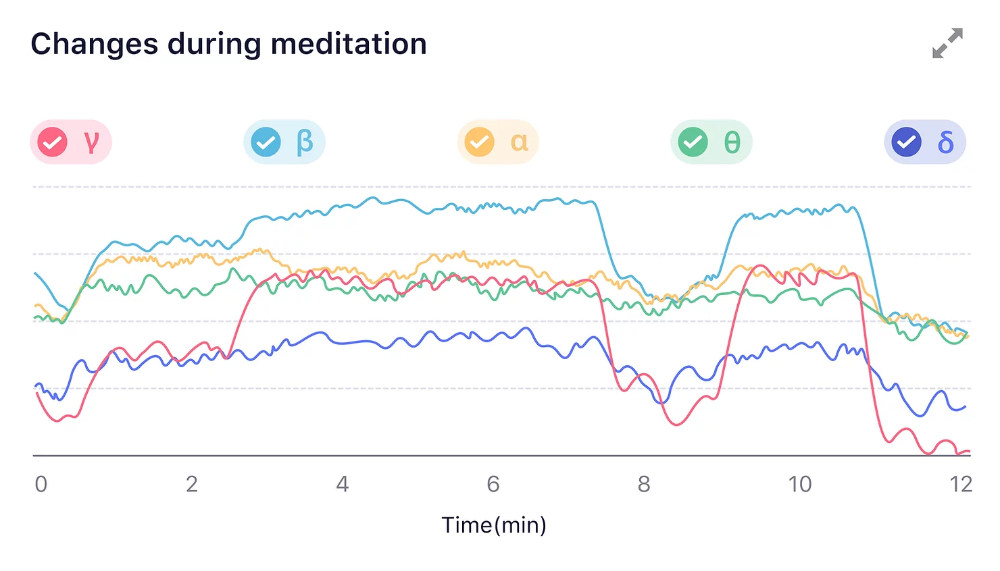

## How to understand Brainwave Rhythms graph?

What are [Brainwave Rhythms](/Glossary/What-is-Brainwave-Rhythms)?

The change of brainwave energy reflects the change of mental state during meditation.

#### Absolute Brainwave Rhythm (dB) in a typical meditation state
(As a 3-year meditator, his alpha and gamma wave energy showed an increasing trend as he entered the meditation state.)

#### Absolute Brainwave Rhythm (dB) in certain meditation states
(The user has many years of meditation experience, and he shifted ways of practice as two distinctly different states emerged in which beta and gamma wave energy rose significantly.)

==Tips: The value of the y-axis is dB, but the scale is not fixed. It's made based on the highest and lowest value of each session.==

