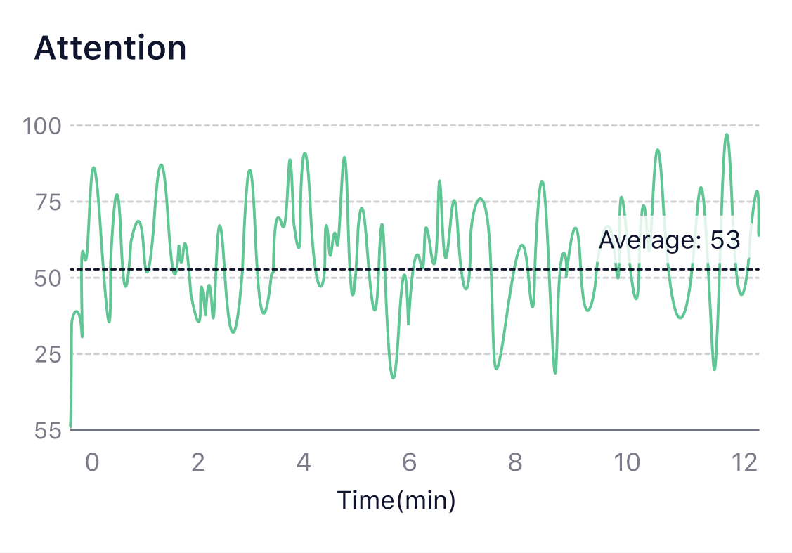
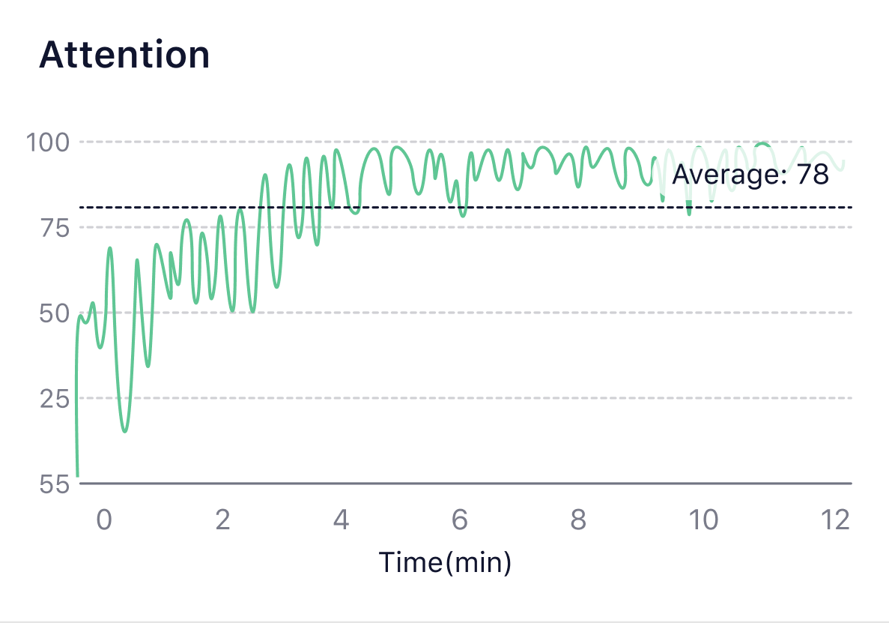

## How to understand the Attention graph?

What is [Attention](/Glossary/What-is-Attention)?

Many types of meditation need you to be focused on things such as your breath or an object. If you realize you are distracted, you need to come back and focus your mind on it again. The Attention index shows how much you are focused and how it changes. Without long-term practice, the Attention index is hard to keep high, generally up and down. By practicing meditation, you can keep focused at a high level and stay concentrated longer.

Example: Meditation beginner's attention (midlevel, up and down).

After long-term practice, the veteran's attention (increasing soon and keeping on at a high level).

See the relationship between Attention and Relaxation in [Attention & Relaxation Graph](/Know_more_about_the_reporters/How-to-understand-Attention&Relaxation-graph)