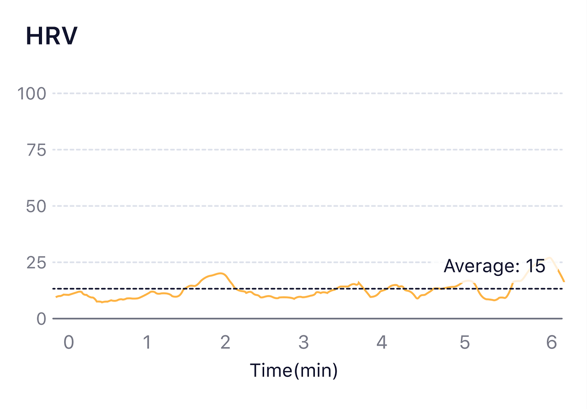
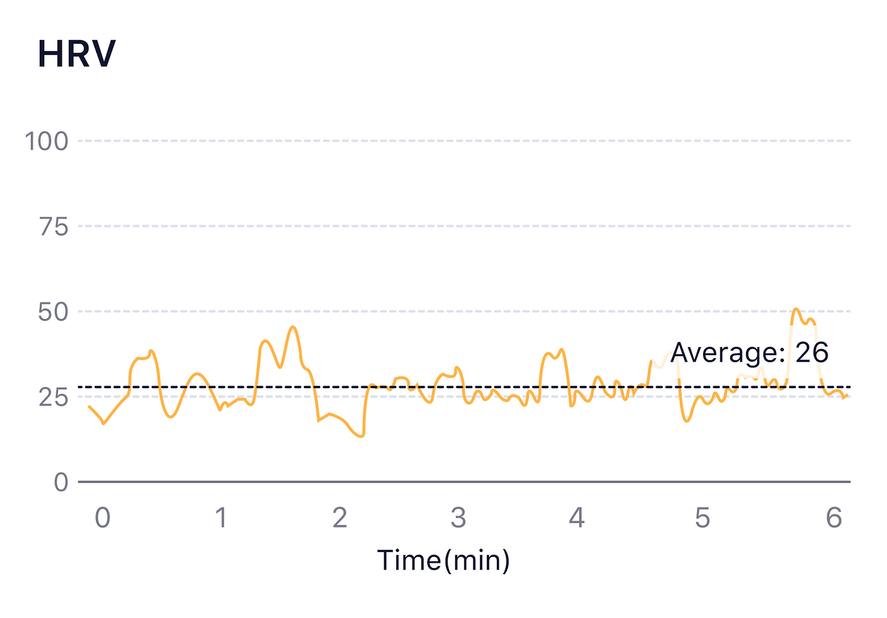
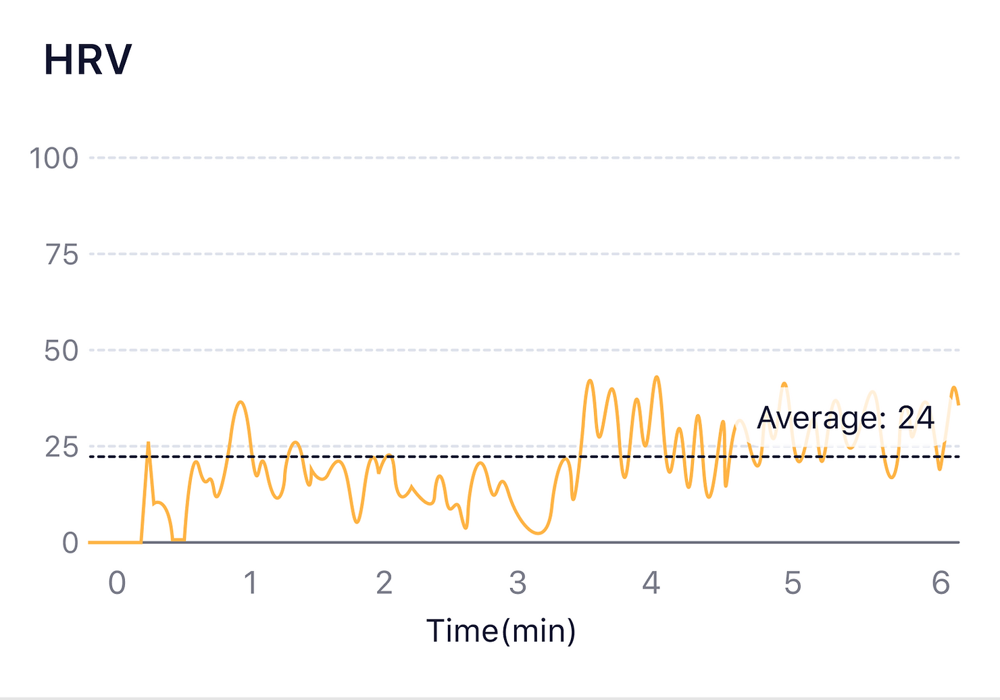

## How to understand the HRV graph?

What is [HRV](/Glossary/What-is-Heart-Rate-Variability)?

Graph of a new meditator with low HRV average.

Graph of an experienced meditator with higher HRV average.

The graph shows how HRV changes as a result of regular deep breathing after 3 minutes.

