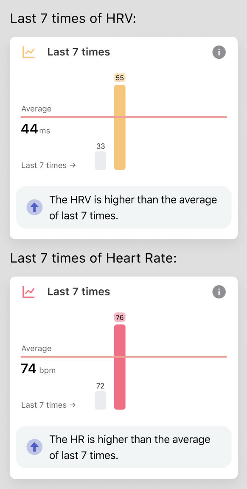
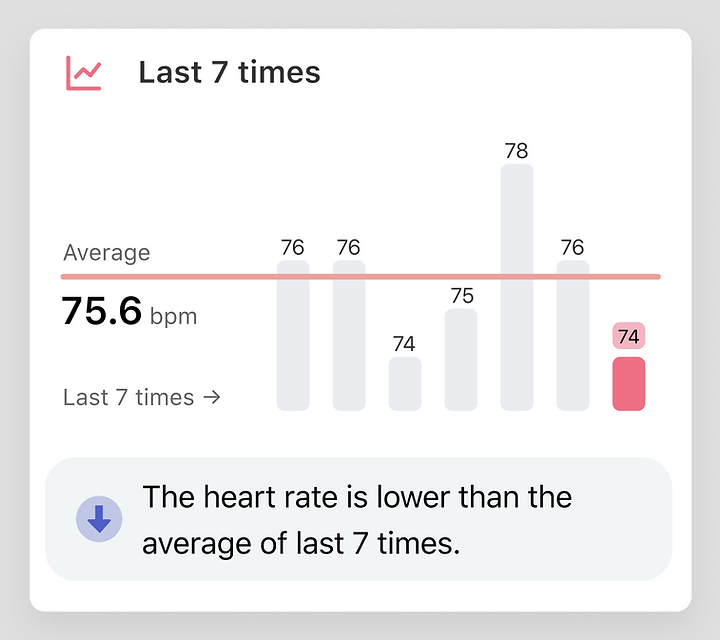

## How to understand the Last 7 Times graph?

The graph of the Last 7 times is mainly for two purposes:

- Display changes of the last 7 times;

- Offer comparisons of current data with the previous 7 data and the average of 7 times.

So in order to highlight the changes and comparisons of the data, we’ll make some adjustments to the data displayed.

### Histogram height is not actual numerical height

The heights of the highest and lowest bars are fixed. The highest and lowest bars correspond to the maximum and minimum values in the data, respectively.

For example, in the following two figures, the height of the highest bar and the lowest bar are the same, but they correspond to different values. The actual HRV values for the first graph are 33 and 45. The second graph corresponds to actual heart rates of 72 and 76.

The remaining bars are calculated based on the scale. For example, in the figure below, the actual heart rate corresponding to each bar is 76, 76, 74, 75, 78, 76, 74.

### Mean
The horizontal line in the graph is the mean line, and you can judge the level of the data by comparing it with the mean line.

### Data evaluation
You can quickly judge the current level of data through the icons and comments in the review.