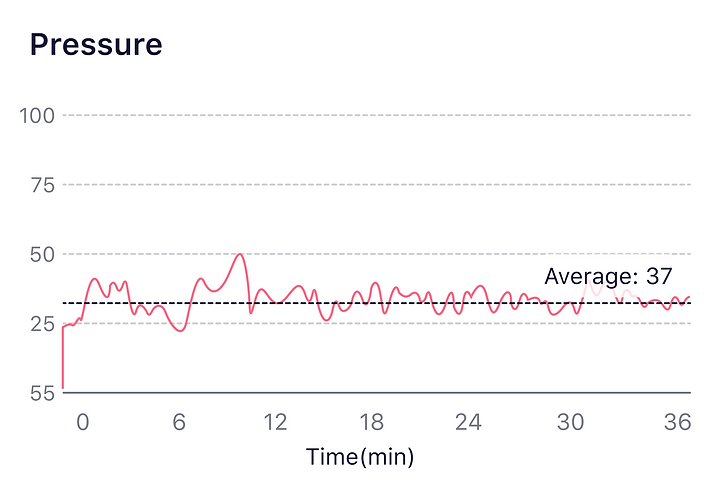
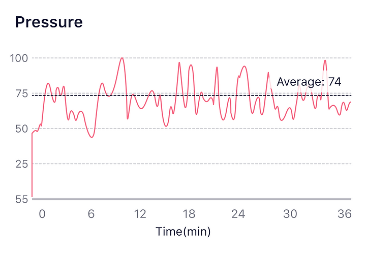

## How to understand the Pressure graph?

What is [Pressure](/Glossary/What-is-Pressure)

During meditation, deep breathing training can effectively reduce stress, and long-term meditation training can improve stress resilience.

When you are doing meditation, generally, you'll have a low and stable pressure level.

It's a typical trend that shows how your pressure level changes when you are working, generally up and down at a higher level.

:::tip
Check out the Pressure Graph and Relaxation Graph, and you can see how relaxed are your physical and phycological states.
:::