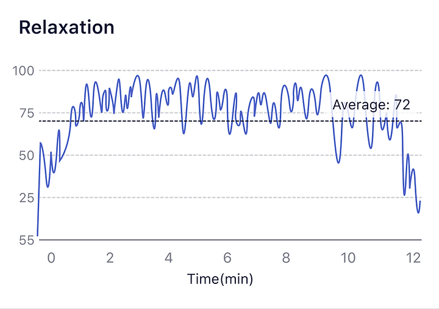

## How to understand the Relaxation graph?

What is [Relaxation](/Glossary/What-is-Relaxation)

Doing meditation helps to relax the brain. The Relaxation index can reflect the trend of relaxation during meditation. Generally, after you close your eyes, feel relaxed, or enter the meditation state, your relaxation value will increase. After relaxation training, the relaxation level can be improved, and you'll be more resilient.

The change in relaxation degree is related to meditation techniques. Generally, when you close your eyes and become relaxed, the relaxation degree will increase, while if you focus your mind, the relaxation degree may be lower. The relaxation index can reflect the trend of relaxation during the meditation process.

See [Attention & Relaxation Graph](/Know_more_about_the_reporters/How-to-understand-Attention&Relaxation-graph)

