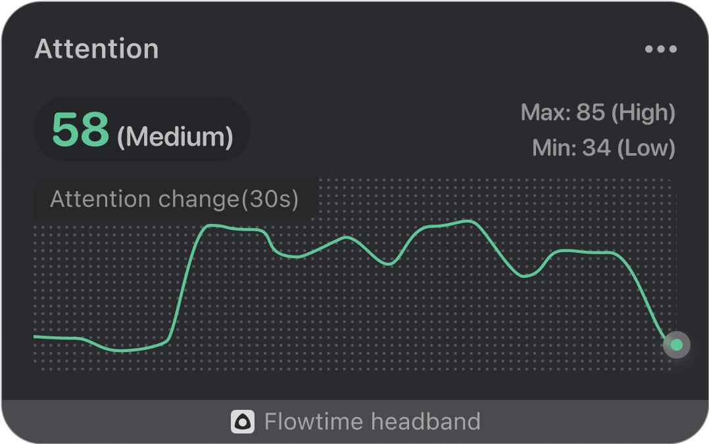

### Realtime Attention

The curve in the real-time attention graph shows the change in attention over a 30-second period. The upper left corner shows the current attention, and the upper right shows the highest and lowest attention ever seen
in this session.

Attention value is not displayed when the device is not worn or valid brainwaves are not detected. After wearing the device, the signal acquisition requires a period of initialization, and the attention value will be displayed after the initialization is completed. During the process, if the signal quality is poor due to interference, the attention value may remain unchanged for a period of time, and return to normal when the signal is stabilized again.

