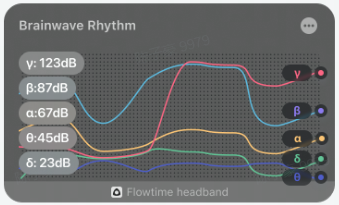
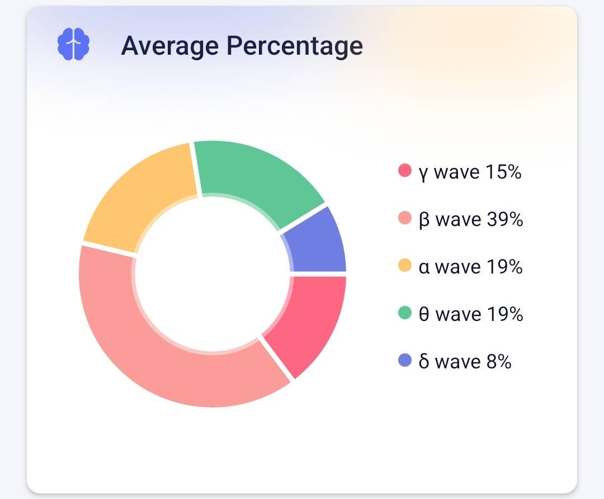

## Realtime Brainwave Rhythms

The realtime brainwave rhythm graph shows the trend of brainwave rhythm in 20 seconds. The curves of different colors in the figure represent the power trends of alpha wave, beta wave, theta wave, delta wave, and gamma wave respectively. The value on the left is the power of the five brainwave rhythms at the current moment, and the unit is decibel (dB).

## Brainwave-rhythm Proportion

The trend graph of the proportion of brainwave rhythms reflects the change of the proportional relationship between the five brainwave rhythms over time. The horizontal axis is time, and the vertical axis is the proportion of the five brainwave rhythms. The vertical width of each color block in the figure represents the proportion of this brainwave rhythm. The wider the color block, the higher the proportion of this brainwave rhythm. 

