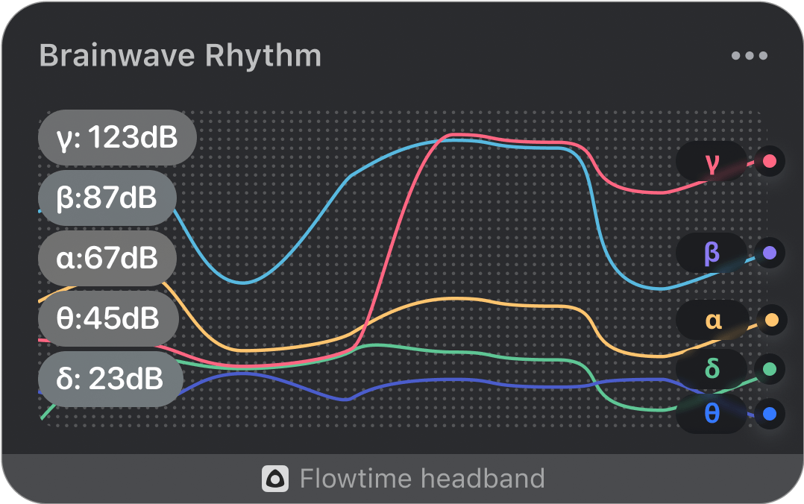

## Realtime Brainwave Rhythms

The realtime brainwave rhythm graph shows the trend of brainwave rhythm in 20 seconds. The curves of different colors in the figure represent the power trends of alpha wave, beta wave, theta wave, delta wave, and gamma wave respectively. The value on the left is the power of the five brainwave rhythms at the current moment, and the unit is decibel (dB).

