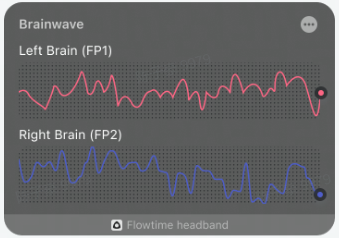
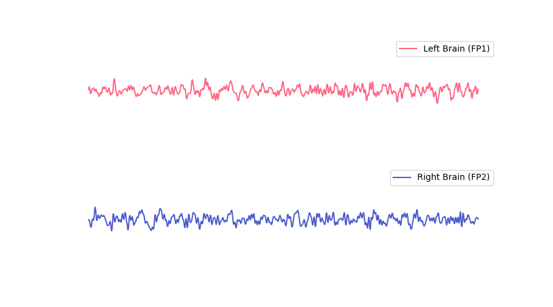
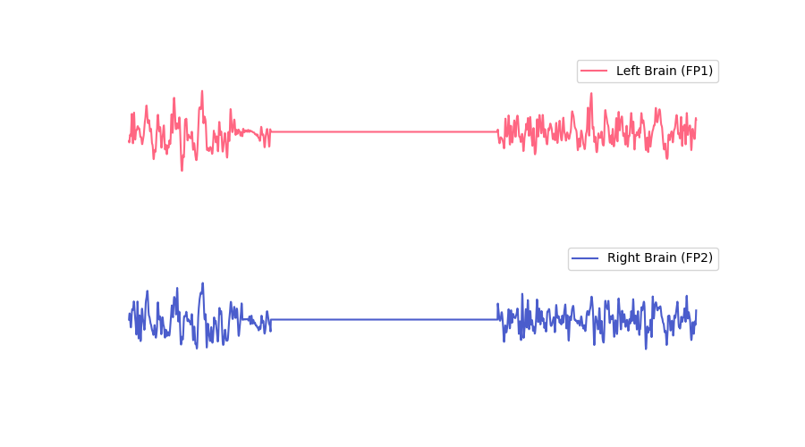
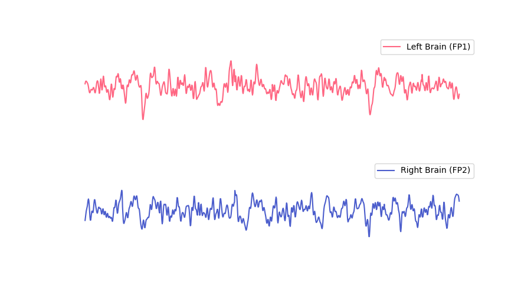

## Realtime Brainwave

Realtime brain graph shows left forehead (Fp1) and right forehead (Fp2) brainwaves over 5 seconds.

Brainwaves appear as a straight line when the device is not worn or when no valid brainwaves are detected. After wearing the device, signal acquisition requires an initialization time. During this period, the noise is relatively large, which may cause the brainwave display to be unstable. After the initialization is completed, stable brainwaves will be displayed. The duration of initialization is related to the skin condition, generally about 30 seconds to 1 minute, and it may take longer for dry skin.

:::info
For a better experience, real-time brainwaves retain a small amount of electro-ocular information, and small facial muscle activities such as blinking and eye movements can be reflected on waveforms. Large-scale facial muscle activity, such as clenching teeth, may cause too much interference with signals, preventing effective brainwaves from being detected.
:::

### Normal Brainwaves

### Disturbed Brainwaves

### Brainwaves During Blinking or Eye Movement

