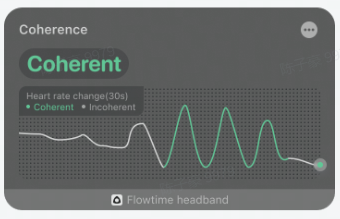

### Realtime Coherence

The curve in the realtime coherence graph shows the coherence state over a 30-second period. The upper left corner shows whether the current state is coherent, the curve is the real-time heart rate curve. The color of the curve shows the time period of the coherent state. The curve in the coherent state is green, and presents a regular periodicity, and the curve in the non-harmonious state is gray.

Coherence is not displayed when the device is not worn or a valid heart rate is not detected. After wearing the device, the signal acquisition requires a period of initialization . After the initialization is completed, the heart rate curve and the current state of coherence will be showed. During the process, if the signal quality is poor due to interference, the heart rate value may remain unchanged for a period of time, when the coherence state cannot be identified. When the signal is stabilized again, it will return to normal.

