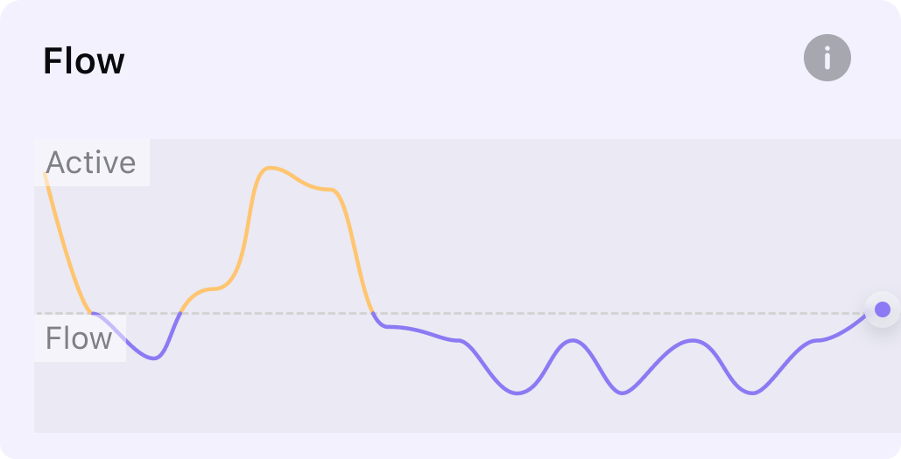

### Realtime Flow

The Flow state is a state of being fully present and deeply relaxed. * [Learn more](/Glossary/What-is-Flow)

The realtime flow shows the changes in brain status over 30 seconds.

The graph depicts three states of mind: active, neutral, and flow.

Initially, the line is high when the mind is active but gradually drops to neutral as you relax. With further relaxation and presence, you'll experience flow.

However, if the headband is not worn or ineffective brainwaves are detected, the flow status cannot be displayed, resulting in a straight line.

After you put on the headband, it may take some time for the headband to acquire signals and calibrate. During the session, if the signal gets poor due to interference or movement, it may cause the flow line to remain unchanged until it stabilizes again.

After finishing this practice, you'll see the session report with the whole trend. * [Learn more](/trend/flow-trend)
