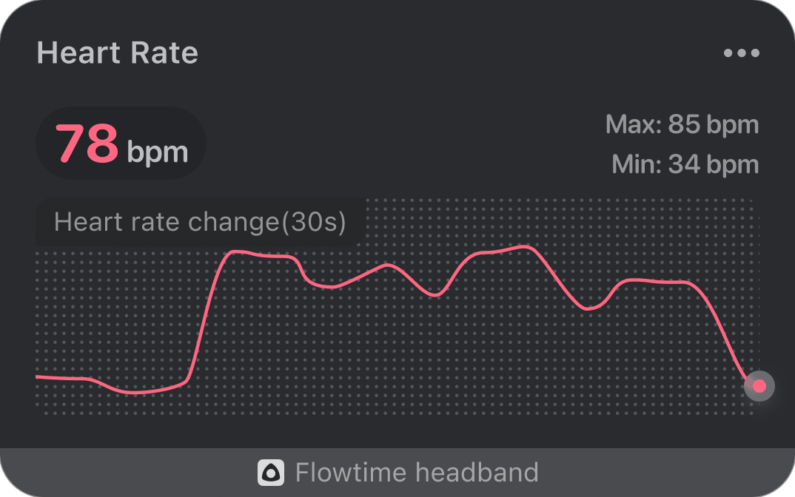

## Realtime Heart Rate

The curve in the realtime heart rate graph shows the change in heart rate over a 30-second period. The upper left corner displays the current heart rate value, and the upper right corner displays the highest and lowest heart rate values that have appeared in this session.

The heart rate value is not displayed when the device is not worn or a valid pulse wave is not detected. After wearing the device, signal acquisition requires a period of initialization, and the heart rate value will be displayed after the initialization is completed. During the process, if the signal quality is poor due to the poor fit between the body and the sensor, the heart rate value may remain unchanged for a period of time, and return to normal when the signal is stabilized again.
