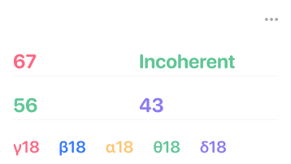

### Realtime overview

The Flowtime Meditation Headband's Realtime Bio-Daata
Overview provides a comprehensive snapshot of your
biodata during meditation. This dashboard displays real-
time metrics including Heart Rate (BPM), Coherence
(Coherent/Incoherence), Relaxation (0-100), Attention
(0-100), and Brainwave Rhythms (percentage of α, β, γ, θ,and δ waves). These metrics are updated in real-time,
offering insights into your mental and physical state during meditation.

