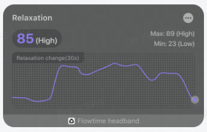

## Realtime Relaxation

The curve in the realtime relaxation chart shows how relaxation changes over a 30-second period. The upper left corner shows the current relaxation level, and the upper right corner shows the highest and lowest relaxation levels that have occurred in this session.

Relaxation values are not displayed when the device is not worn or when no valid brainwaves are detected. After wearing the device, the signal acquisition requires a period of initialization time, and the relaxation value will be displayed after the initialization is completed. During the process, if the signal quality is poor due to interference, the relaxation value may remain unchanged for a period of time, and return to normal when the signal is stabilized again.