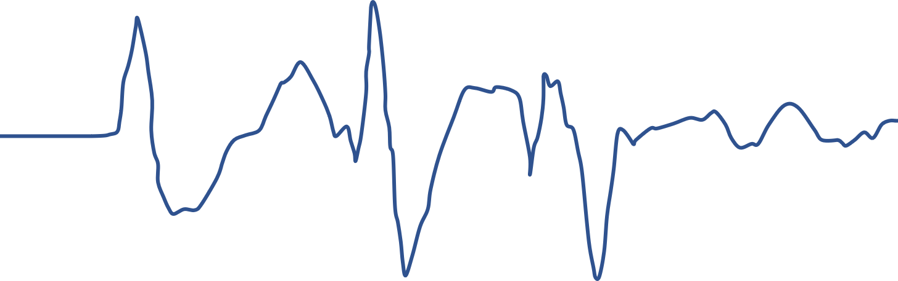
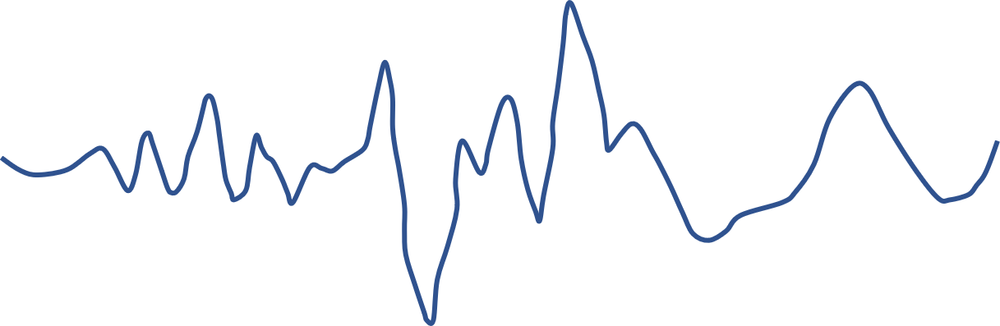

## Realtime Respiration

The Realtime Respiration shows the respiratory wave over a 1-minute period. The upper left corner shows the current respiratory rate, and the upper right corner displays the highest and lowest respiratory rates ever seen in this session.

When the device is not worn, the respiratory rate is not displayed, and the respiratory wave appears as a straight line. After wearing the device, signal acquisition requires a period of initialization. During the initialization, the respiratory wave may be relatively disordered. After the initialization is completed, the respiratory rate and respiratory wave will be displayed. During the process, if the signal quality is poor due to the poor fit between the respiratory and the sensor, the rate may remain unchanged for a period of time, and the respiratory wave will show a large disturbance. When the signal is stabilized again, it will return to normal.

### Normal and stable respiratory waves

### Respiratory waves in the initialization phase (turbulent)

### Disturbed respiratory waves

