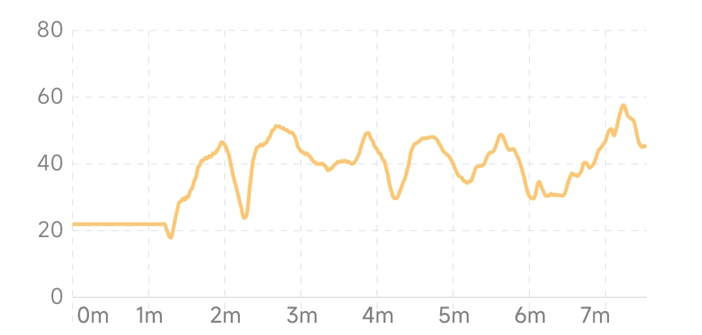
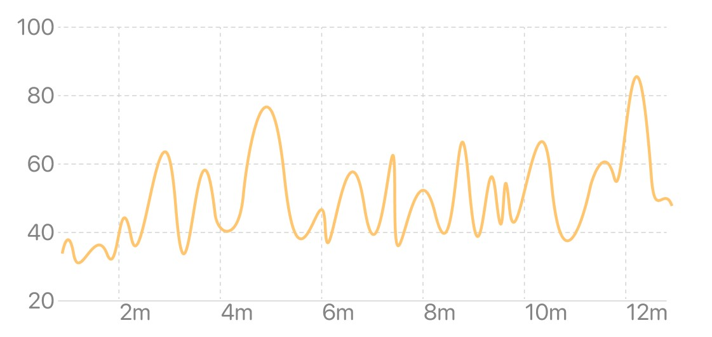
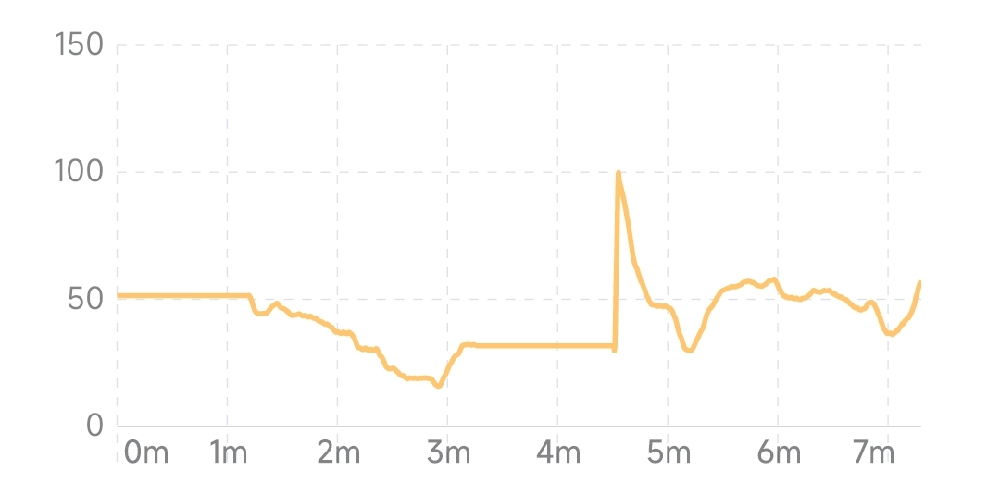
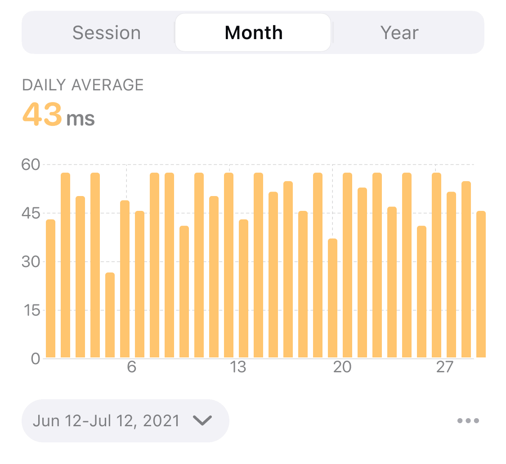
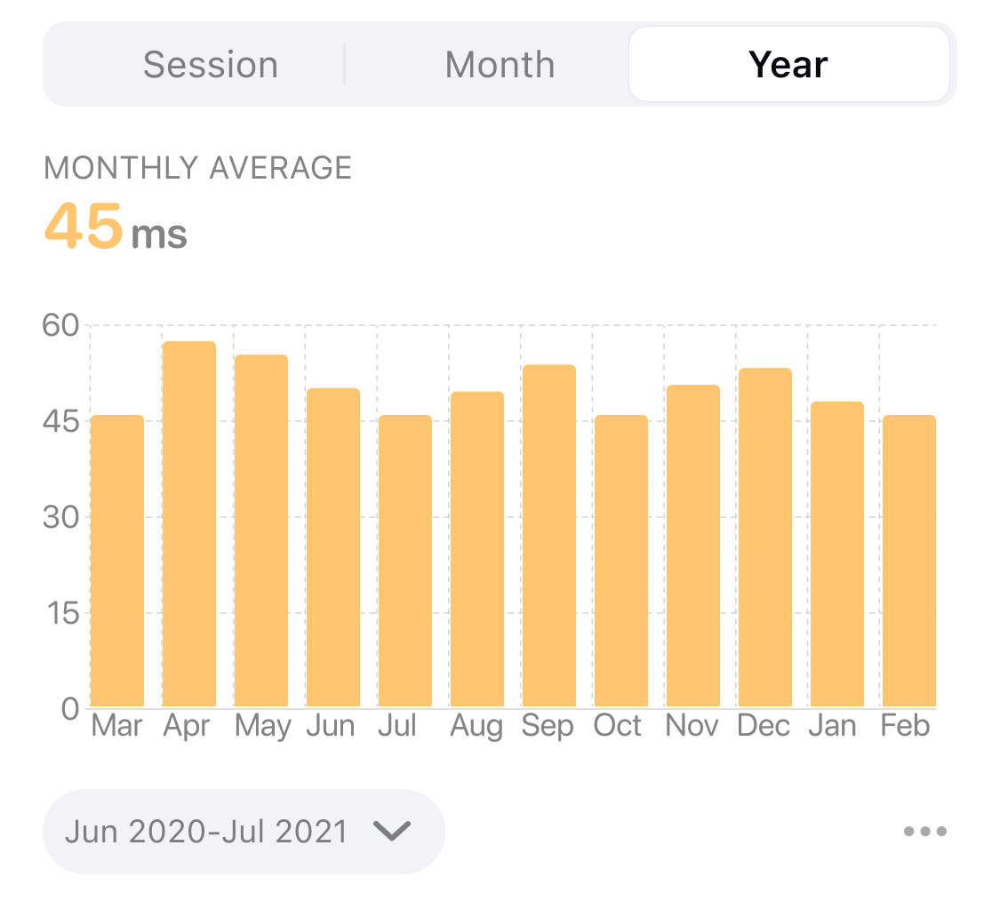

## HRV Trend

The change in heart rate variability graph reflects changes in HRV over time. The horizontal axis is time and the vertical axis is HRV level. Higher curves or bars indicate higher HRV levels. Since the baseline HRV level of each individual is different and may vary greatly in different states, the long-term trend of HRV measured in similar states is more meaningful.

### Session View

The session view reflects the trend of HRV during the session. Heart rate is closely related to physical state. During meditation, HRV may vary as the meditative state changes. HRV values are generally higher when breathing is relaxed. With long-term meditation practice, the overall level of HRV will improve.

:::info
Sometimes the heart rate fluctuates greatly in a short period of time due to exercise, talking, etc. during the experience, resulting in a local peak in the HRV curve. This state is different from the state during normal meditation, so the higher HRV values obtained at this time are not meaningful for comparison.
:::

#### HRV curve in a typical meditative state

#### HRV rises and remains high after entering a state during meditation

#### Local peaks in HRV curve due to interference

### Month View
The month view reflects the trend of the HRV average level in the last 1 month, and the abscissa is the date. The height of each bar in the bar graph represents the HRV average for all sessions that day. A short-term trend in HRV levels can be seen from the month view.

### Year View
The year view reflects the trend of HRV average level in the last 1 year, and the abscissa is the month. The height of each bar in the histogram represents the average of the daily HRV averages for the month. Long-term trends in HRV levels can be seen from the year view.
