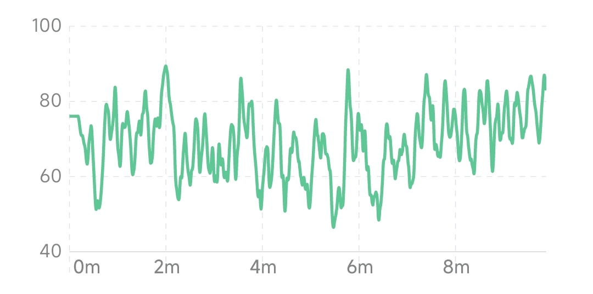
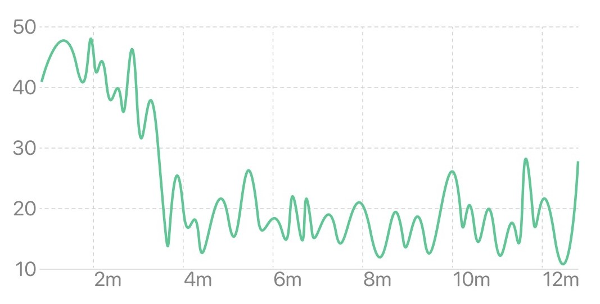

## Attention Trend

The attention trend graph reflects the change of attention over time. The horizontal axis is time, and the vertical axis is attention level. The higher the curve or bar, the more focused it is.

### Session View

The session view reflects the changing trend of real-time attention during the session. Some types of meditation require controlled attention, keeping the brain active or highly alert. People who have not undergone long-term training have difficulty maintaining a high level of attention for a long time, generally showing up and down. People who have undergone long-term concentration training can achieve a high level of concentration during meditation and maintain it for a long time. In some relaxation-focused meditations, lower levels of concentration may result due to reduced brain activity.

#### Changes in attention during typical meditation (attention levels are high and low)

#### Changes in meditative attention after long-term concentration training (continuously rising and maintaining high levels)

#### Changes in attention in relaxation meditation (attention levels drop and remain low)

### Month View

The month view reflects the trend of the average level of attention in the last 1 month, and the horizontal axis is the date. The height of each bar in the histogram represents the average attention span of all experiences that day. A short-term trend in attention levels can be seen from the month view.

### Year View

The year view reflects the trend of the average level of attention in the last 1 year, and the abscissa is the month. The height of each bar in the histogram represents the average of the daily attention averages for the month. Long-term trends in attention levels can be seen from the year view.