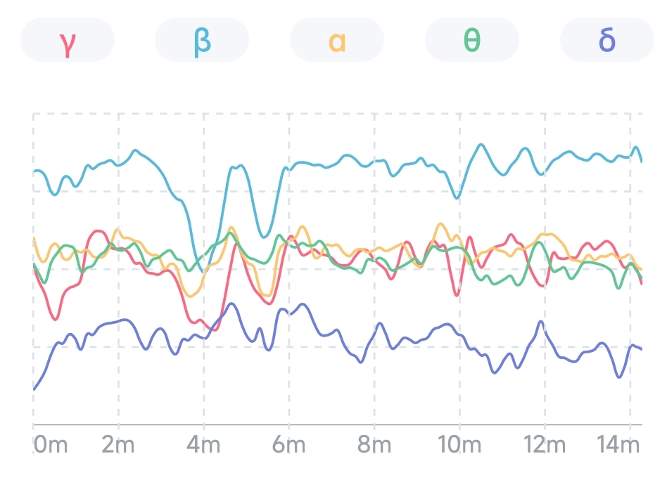

## Brainwave Rhythm Proportion Trend

The trend graph of brainwave rhythm proportion reflects the proportion change of the five brainwave rhythms over time. The horizontal axis is time, and the vertical axis is the proportion of the five brainwave rhythms. The vertical width of each color block in the figure represents the percentage of this brainwave rhythm. The wider the color block, the higher the proportion of this brainwave rhythm. The sum is 100%.

### Session View

The session view displays how the proportion of the five brainwave rhythms changes during the session.

For example, you can see from the figure below that the proportion of gamma waves and beta waves increased significantly after 10 minutes, while the proportion of alpha waves and theta waves decreased. The growth of gamma and beta waves indicated an increase in concentration and arousal. At the end of the session, the proportions returned to normal levels, marking the end of concentration and arousal state.

### Month View
The Month view reflects the proportion trend of the five brain wave rhythms in the last month. The horizontal axis is the date.

Tap any point in the graph, and you'll see the average percentage on that day. If you do more than one session a day, the number you see is the average percentage out of all sessions you have done that day.

### Year View
The year view reflects the changing trend of the brainwave rhythm proportion in the last year, and the horizontal axis is the month.

Tap any point in the graph, and you'll see the average percentage of that month. The number you see is the average of all sessions you have done in that month.

## Brainwave Rhythm Power Trend

The Brainwave Rhythm Power Trend Graph reflects the change of the absolute value of the 5 kinds of brainwave rhythm power over the time of one session. The horizontal axis is time, and the vertical axis is the absolute power of the five brainwave rhythms in the unit of dB. The higher the curve, the higher the power of this brainwave rhythm.

For example, you can see from the following figure that during the session, the power of all rhythms in the first half rose slowly. And then the power of the gamma wave and beta wave in the second half increased significantly. At the same time, the alpha, theta, and delta waves decreased slightly,  indicating the user was more focused and arousal in the second half.

## Brainwave-rhythm Proportion

The trend graph of the proportion of brainwave rhythms reflects the change of the proportional relationship between the five brainwave rhythms over time. The horizontal axis is time, and the vertical axis is the proportion of the five brainwave rhythms. The vertical width of each color block in the figure represents the proportion of this brainwave rhythm. The wider the color block, the higher the proportion of this brainwave rhythm.

