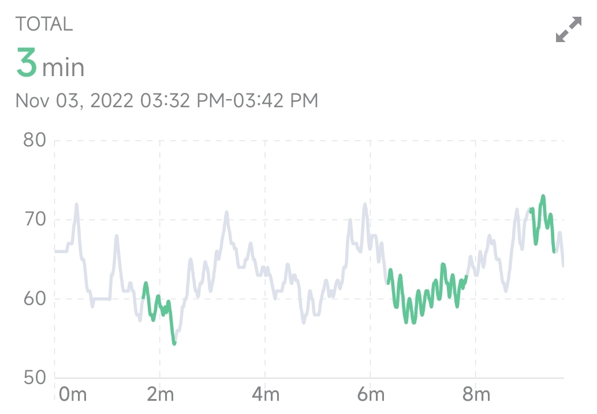
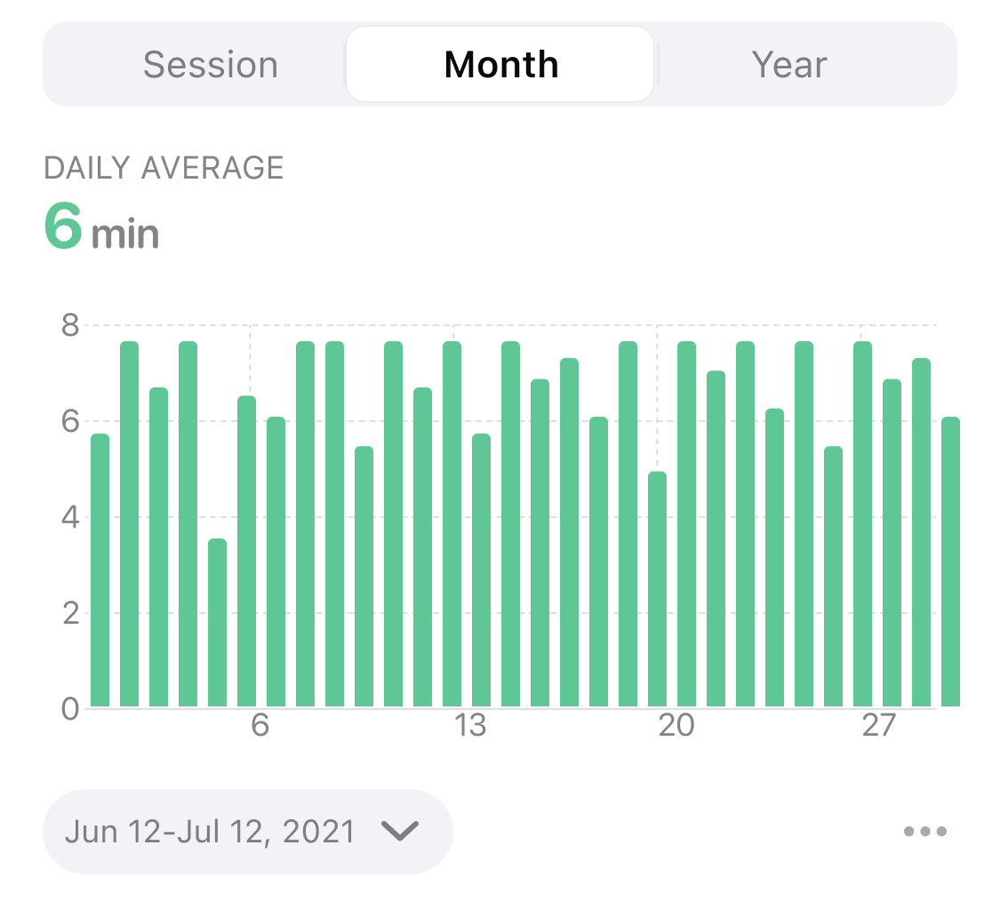
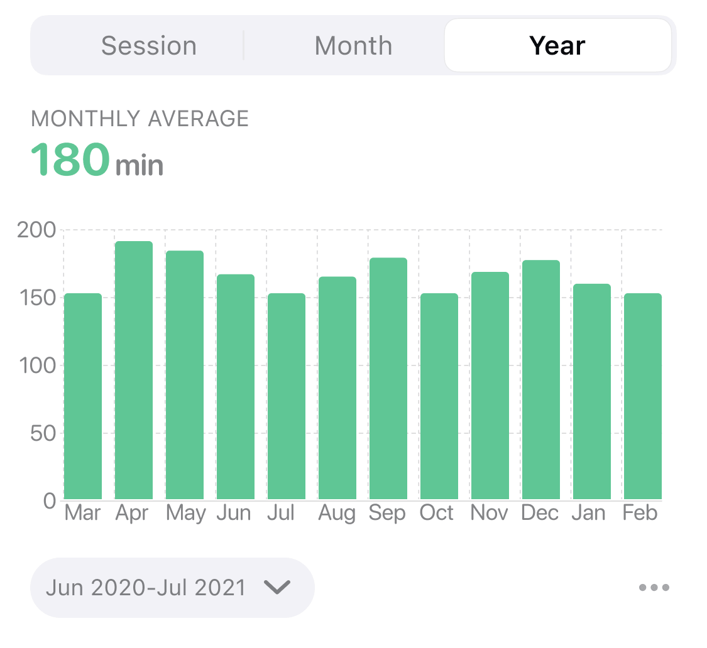

## Coherence Time Trend

The Coherence time statistics chart records the trend of the accumulated duration of the coherent state.

Heart rate curve reflects coherence (heart rate changes disorderly in the gray part, and a coherent state is achieved through regular deep breathing in the green part)

### Session View

The session view records the time period of the coherent state during the session. The upper left corner shows the total time of the coherent state of the current experience. The graph is the real-time heart rate trend of the session, the abscissa is the time, and the ordinate is the heart rate. The curve is the real-time heart rate curve, the color of which shows the coherent state. Green curve means coherent, which presents a regular periodicity, and gray means non-coherent .
The pattern of breathing during meditation affects the pattern of heart rate variation. The heart rate curve can intuitively reflect the coherent state during meditation. In general, the change of heart rate is disordered. Through resonant breathing (inhale for 5 seconds, exhale for 5 seconds), the heart rate can show a periodic rhythm and achieve a state of heart-brain coherence. Long-term breathing training can make it easier for the body to enter a state of coherence and maintain it for a longer period of time, resulting in a longer coherence time and a higher proportion of coherence.

### Month View

The month view reflects the trend of daily duration of coherent state in the last 1 month, and the abscissa is the date. The height of each bar in the bar graph represents the sum of duration of coherent state that day. A short-term trend in coherence can be seen from the month view.

### Year View
The year view reflects the trend of monthly duration of coherent state in the last 1 year, with the abscissa as the month. The height of each bar in the histogram represents the total duration of coherent state for the month. The long-term trend in coherence can be seen from the year view.
