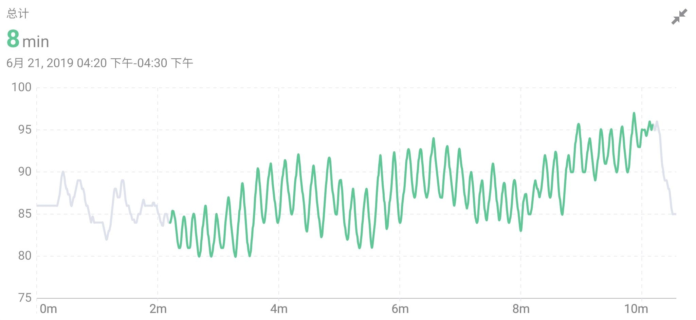

## Resonant Breathing
Breathing is one of the few things in life that most of us can do without thinking about it. But we breathe involuntarily doesn't mean that we're doing it correctly. Science says 90% of us have been breathing wrong.

Most people tend to have short, shallow breaths with their chests. Normal respiration rates for an adult person at rest range from 12 to 16 breaths per minute. Therefore, insufficient oxygen enters the body, resulting in risks like elevating cortisol, fatigue, and even stress on your heart. Elevated cortisol is associated with many health conditions, such as weight gain, mood swings, and trouble sleeping.

Deep and rhythmical breaths help all organs get enough oxygen to function, which means less muscle tension, lower blood pressure, better mood, and a more robust immune system and nervous system.

There are various modes of deep and slow breathing, among which Resonant Breathing is the one that has been widely studied.

Heart rate and blood pressure regulate each other to form a closed-loop circuit with a cycle of approximately 10 seconds.

When you **inhale for 5 seconds and exhale for 5 seconds**, this constitutes a 10-second breathing cycle that resonates with the circuit of heart rate and blood pressure. This breathing pattern is known as Resonant Breathing.

Studies indicate that resonant breathing can significantly reduce negative emotions such as anxiety, depression, and anger and improve creativity and athletic performance [^1][^2]. Patients with chronic pain, asthma, and pre-hypertension can mitigate their symptoms by practicing resonant breathing [^3][^4][^5].

Guided Breathing mode in the Flowtime App will guide you to practice resonant breathing through sounds, images, and vibrations.

As you breathe steadily and regularly in resonance, the heart rate change will then show a steady, highly ordered state called **Coherence Time**. It's a state of enhanced cognition and energetic calm. If your breath is not stable, it is not easy to achieve Coherence Time, but you can improve that through regular breathing exercises.

[^1] Lehrer P, Kaur K, Sharma A, Shah K, Huseby R, Bhavsar J, Sgobba P, Zhang Y. Heart Rate Variability Biofeedback Improves Emotional and Physical Health and Performance: A Systematic Review and Meta Analysis. Appl Psychophysiol Biofeedback. 2020 Sep;45(3):109-129. doi: 10.1007/s10484-020-09466-z. Erratum in: Appl Psychophysiol Biofeedback. 2021 Dec;46(4):389. PMID: 32385728.

[^2] Jiménez Morgan, S., Molina Mora, J.A. Effect of Heart Rate Variability Biofeedback on Sport Performance, a Systematic Review. Apple Psychophysiology Biofeedback 42, 235–245 (2017). https://doi.org/10.1007/s10484-017-9364-2

[^3] Schmidt, J.E., Joyner, M.J., Carlson, C.R. et al. Cardiac Autonomic Function Associated with Treatment Adherence After a Brief Intervention in Patients with Chronic Pain. Appl Psychophysiol Biofeedback 38, 193–201 (2013). https://doi.org/10.1007/s10484-013-9222-9

[^4] Lehrer PM, Vaschillo E, Vaschillo B, Lu SE, Scardella A, Siddique M, Habib RH. Biofeedback treatment for asthma. Chest. 2004 Aug;126(2):352-61. doi: 10.1378/chest.126.2.352. PMID: 15302717.

[^5] Chen, S., Sun, P., Wang, S. et al. Effects of heart rate variability biofeedback on cardiovascular responses and autonomic sympathovagal modulation following stressor tasks in prehypertensives. J Hum Hypertens 30, 105–111 (2016). https://doi.org/10.1038/jhh.2015.27

## Coherence Time Trend

The Coherence time statistics chart records the trend of the accumulated duration of the coherent state.

### Session View

The session view records the time period of the coherent state during the session. The upper left corner shows the total time of the coherent state of the current experience. The graph is the real-time heart rate trend of the session, the abscissa is the time, and the ordinate is the heart rate. The curve is the real-time heart rate curve, the color of which shows the coherent state. Green curve means coherent, which presents a regular periodicity, and gray means non-coherent .
The pattern of breathing during meditation affects the pattern of heart rate variation. The heart rate curve can intuitively reflect the coherent state during meditation. In general, the change of heart rate is disordered. Through resonant breathing (inhale for 5 seconds, exhale for 5 seconds), the heart rate can show a periodic rhythm and achieve a state of heart-brain coherence. Long-term breathing training can make it easier for the body to enter a state of coherence and maintain it for a longer period of time, resulting in a longer coherence time and a higher proportion of coherence.

#### Heart rate curve reflects coherence (heart rate changes disorderly in the gray part, and a coherent state is achieved through regular deep breathing in the green part)

#### Heart rate curve in coherent state (continuous long coherence) during breathing exercises by experienced meditators

### Month View

The month view reflects the trend of daily duration of coherent state in the last 1 month, and the abscissa is the date. The height of each bar in the bar graph represents the sum of duration of coherent state that day. A short-term trend in coherence can be seen from the month view.

### Year View
The year view reflects the trend of monthly duration of coherent state in the last 1 year, with the abscissa as the month. The height of each bar in the histogram represents the total duration of coherent state for the month. The long-term trend in coherence can be seen from the year view.
