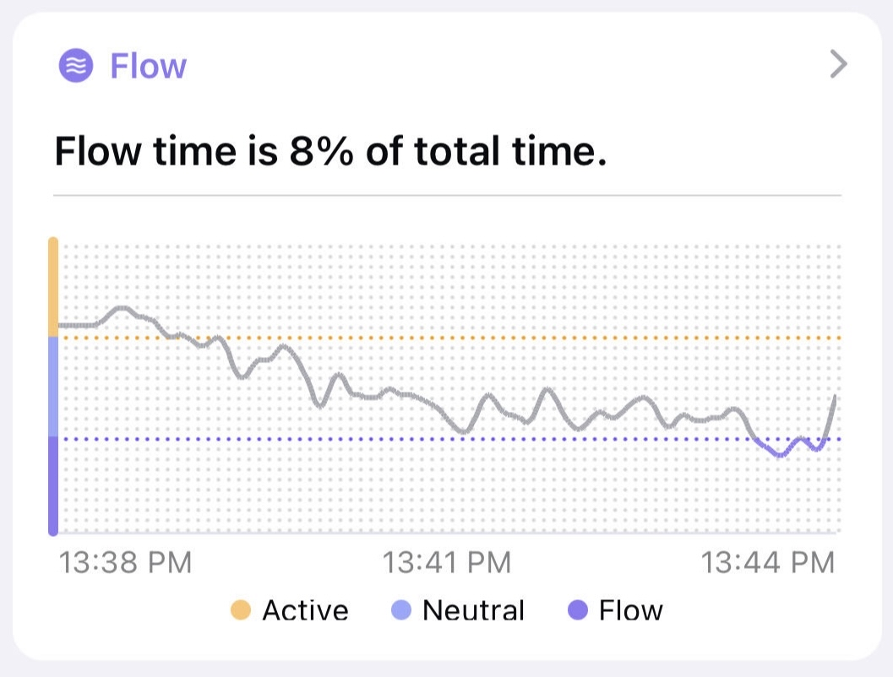
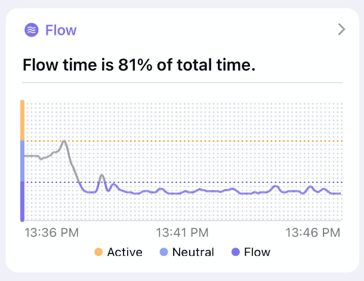
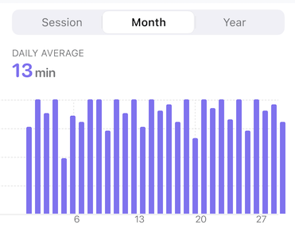
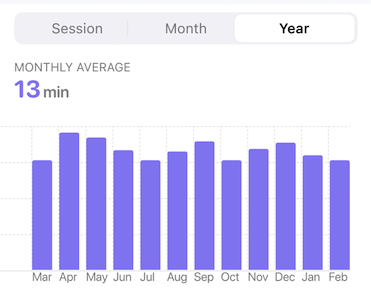

## Flow Time Trend

The flow time trend records how the flow state changes over time.

### Session View

The graph shows how our mind behaves during meditation. The graph has a horizontal line representing time and a vertical line indicating our mental activity level. This activity is divided into active, neutral, and flow.

When we are in an active state, our mind is busy thinking about various things, while in a neutral state, our mind is relatively calm and not thinking about anything in particular. The flow state is when we feel most present, aware, and deeply relaxed.

The graph has different colors to show how much time we spend in each state. The graph turns purple when we are in a flow state and grey for active and neutral states.

If we are new to meditation, we may find it challenging to flow as our minds are easy to wander and get distracted, which prevents us from focused calm, and deep relaxation. It may take a long time to adjust and get into the flow. But with practice, it would be easier to flow and stay in the flow state longer.

#### It takes a long time to get into the flow for beginners.

#### Experienced meditators get into a flow state faster and stay there longer.

### Month View

The monthly view shows the trend of flow time for the last month. Each bar in the bar graph represents the total flow time for all sessions in a day. The height of the bar shows the short-term trend in flow time. By analyzing the monthly view, you can see how your daily practice affects your overall flow time. You can also identify patterns in your practice, such as whether you have longer flow time during certain times of the day or on certain days of the week. This information can help you adjust your practice to increase your flow time and improve your meditation experience.

### Year View

The graph also has a yearly view that shows the trend of flow time for the last year. Each bar in the bar graph represents the total flow time for all sessions in a month.  By analyzing the yearly view, you can see your progress over time. You can identify whether you are consistently meditating or if you are skipping sessions and how it affects your flow time. This information can help you set goals and track your progress toward achieving them. Additionally, you can use the yearly view to evaluate your overall meditation practice and adjust for the future.
