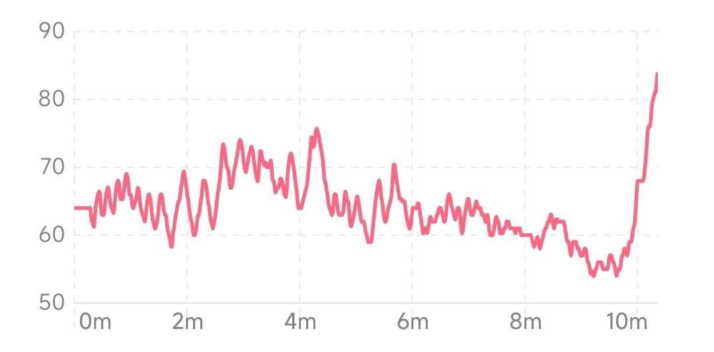

## Heart rate Trend
The heart rate graph reflects the change in heart rate over time. The horizontal axis is time, and the vertical axis is heart rate level. A higher curve or bar indicates a higher heart rate level.
### Session View

The current session view reflects the trend of real-time heart rate during the session. Heart rate is closely related to physical state. Changes in heart rate during meditation may be related to the meditation method. Heart rate may show a decreasing, increasing or flat trend under different meditation methods. Under normal conditions, the change of heart rate is disordered. Through relaxation exercises and regular deep breathing, the heart rate can show a certain periodic rhythm and achieve a state of heart-brain harmony.

#### Heart rate profile during typical meditation (disordered)

#### Heart rate shows a steady trend during meditation

#### Heart rate tends to decrease and increase while meditating

#### Heart rate shows periodic rhythm during meditation

### Month View
The month view reflects the trend of the average heart rate in the last 1 month, and the abscissa is the date. Each point in the line graph represents the average heart rate of all sessions that day, and the bar graph in the background represents the range of heart rate variation for all experiences that day. Short-term trends in heart rate levels can be seen from the month view.

### Year View
The year view reflects the trend of the average heart rate in the last 1 year, and the abscissa is the month. Each point in the line graph represents the average level of the daily average heart rate for the month, and the bar graph in the background represents the range of variation in the average daily heart rate for the month. The long-term trend in heart rate levels can be seen from the year view.
