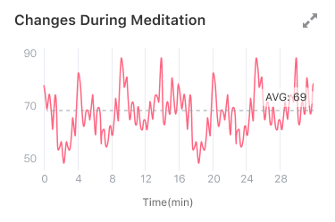
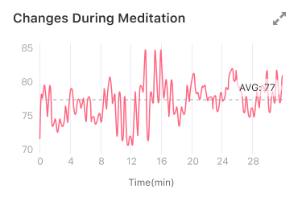
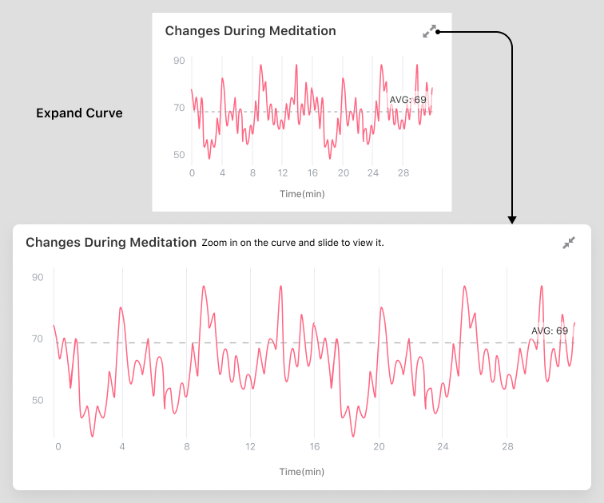

## How to understand the "Changes during Meditation" graph?

### Y-axis / Vertical axis
To highlight the numerical changes during meditation, the vertical axis of heart rate, heart rate variability, and stress level will change accordingly. It means that if the maximum and minimum values are different between two meditation practices, the Y-axis or vertical axis will also be altered. For example, in the graph below, the range of the Y-axis in Graph 1 is 50 - 90, and 70 - 85 in Graph 2.

graph 1

graph 2

### Zoom in to view the graph
Tap the expand button in the upper right corner of the graph, and the graph expanding horizontally will show all the data. At this time, you can zoom in and out with two fingers and drag to see the details.

### Value
The longer you meditate, the more data you’ll see. When there is a lot of data, if the graph is not expanded, the display space is too small to display all data, and the data will overlap. Therefore, the unexpanded figure will only show part of the data, mainly highlighting the overall change.

### Mean line and the average

We draw a mean line on the graph and mark the average. You can measure the value by comparing the value of the curve with the average.
