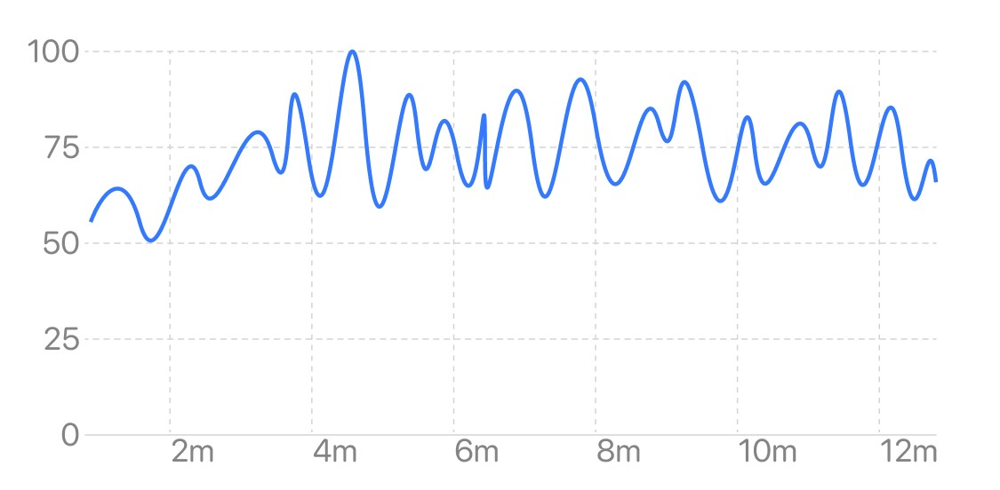
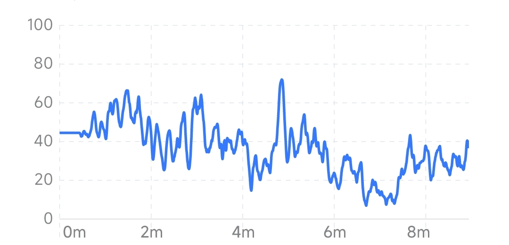

## Relaxation Trend

The relaxation trend chart  reflects the change of relaxation over time. The horizontal axis is time, and the vertical axis is relaxation level. The higher the curve or bar, the more relaxed it is.

### Session View

The session view reflects the trend of real-time relaxation during the session. Most types of meditation are related to relaxation. Generally, when you close your eyes and relax, the relaxation will increase. People who have been trained for a long time can achieve a high level of relaxation during meditation and maintain it for a long time. In some meditations that require concentration, relaxation may be lower.

#### Changes in relaxation with eye-closed

#### Changes in relaxation in experienced meditators (maintaining high levels)

#### Changes in relaxation in attention-based meditation (lower levels of relaxation)

### Month view

The month view reflects the trend of the average level of relaxation in the last 1 month, and the abscissa is the date. The height of each bar in the bar graph represents the average relaxation of all experiences that day. A short-term trend in relaxation levels can be seen from the month view.

### Year View

The year view reflects the trend of the average level of relaxation in the last 1 year, with the abscissa as the month. The height of each bar in the histogram represents the average of the daily relaxation averages for the month. The long-term trend in relaxation levels can be seen from the year view.