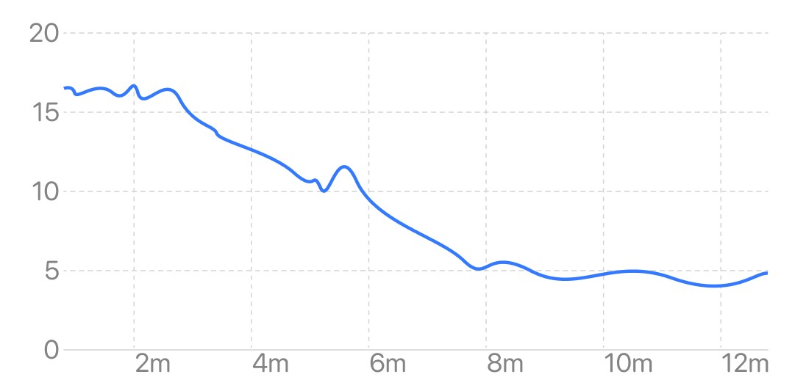

## Respiratory Rate Trend

The respiratory rate trend graph reflects the change of respiratory rate over time. The horizontal axis is time, and the vertical axis is respiratory rate. A higher curve or bar indicates a higher respiratory rate.

### Session View

The session view reflects the trend of the real-time respiratory rate during the session. Respiratory rate can reflect the breathing during meditation. In the state of natural breathing, the respiratory rate is relatively high, generally 12-20 times per minute. During the meditation process, especially in the state of regular deep breathing, it can be seen that the respiratory rate is significantly reduced. During resonant breathing, the respiratory rate is about 6 times per minute, which can achieve a coherent state.

#### Respiratory rate curve in meditation (from natural breathing to resonant breathing)

### Month View

The month view reflects the trend of the average of respiratory rate in the last 1 month, and the abscissa is the date. Each point in the line graph represents the average respiratory rate of all sessions that day, and the bar graph in the background represents the range of respiratory rate variation for all sessions that day. The short-term trend in respiratory rate can be seen from the month view.

### Year View

The year view reflects the trend of the average of respiratory rate in the last 1 year, with the abscissa as the month. The height of each bar in the histogram represents the average of the daily respiratory rate averages for the month. The long-term trend in respiratory rate can be seen from the annual view.