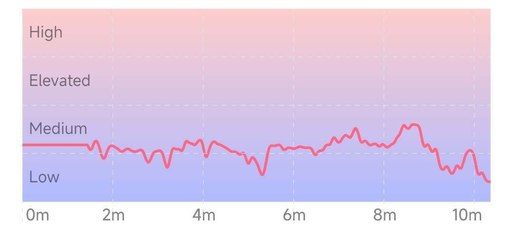
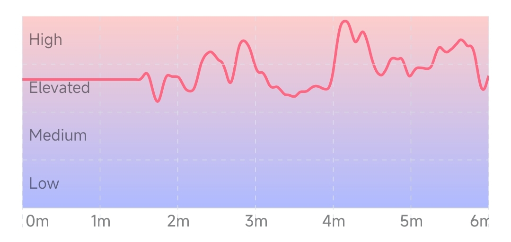

## Stress Trend

The stress level change trend graph reflects the change of stress level over time. The abscissa is time and the ordinate is stress level. The higher the curve, the higher the stress.

### Session View

The session view reflects the change trend of the real-time stress level during the session. During meditation, deep breathing exercises can effectively reduce stress. Long-term meditation training can improve stress levels. People who have not undergone long-term training are easily affected by the outside world and reach higher stress levels. After long-term meditation training, the stress level can be stabilized at a lower value through body adjustment.

:::info
Since the monitoring of the stress level needs to collect some physiological indicators for a long time, the stress level curve in the current experience view may take a long time (more than 1 minute) to show a valid value, before the stress level is a straight line.
:::

#### Stress level changes during typical meditation (stress levels are low and relatively stable)

#### Changes in stress levels in non-meditative (work) states (higher and more volatile stress levels)

### Month View

The monthly view reflects the trend of the average stress level in the last 1 month, and the abscissa is the date. The height of each point in the curve represents the average stress level for all experiences that day. A short-term trend in stress levels can be seen from the monthly view.

### Year View

The  year view reflects the trend of the average stress level in the last 1 year, and the abscissa is the month. The height of each point in the curve represents the average of the daily stress level averages for the month. The long-term trend in stress levels can be seen in the annual view.

