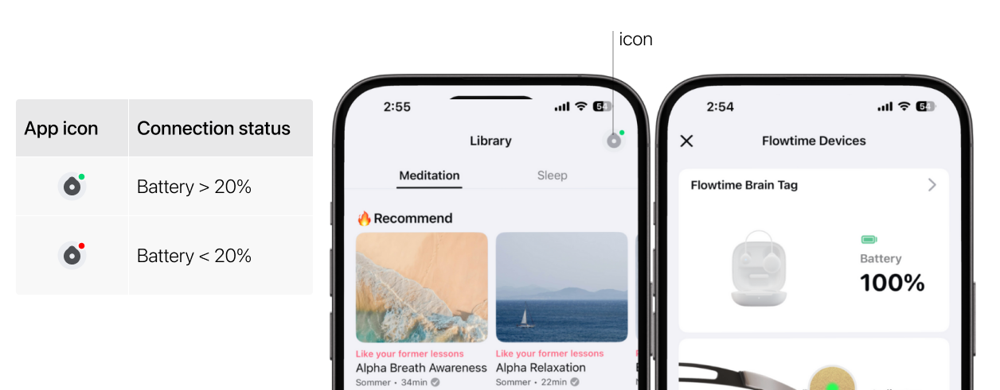

## How to Check Battery Status?

The tag offers up to 10 hours of battery life, giving you flexibility for all-day or night use. The charging case provides up to 8 full charges for the tag. To ensure it’s always ready, place the tag back in the case when not in use.

For prolonged sessions, it’s a good idea to check the battery level beforehand to avoid interruptions.

