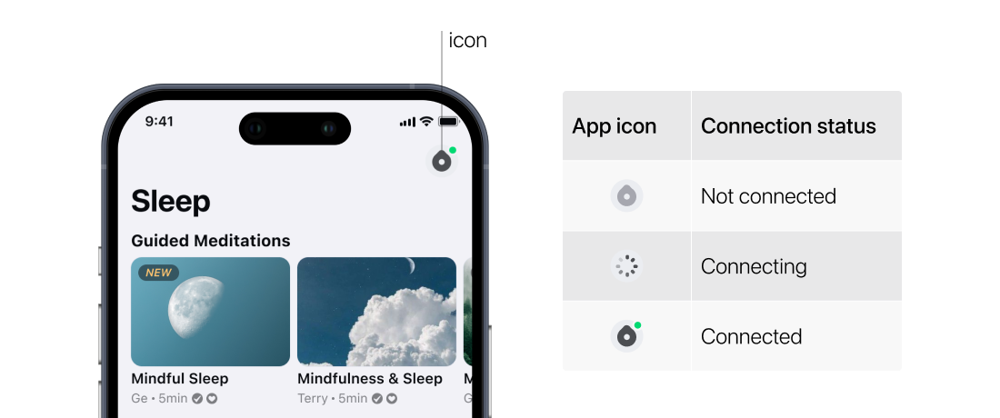
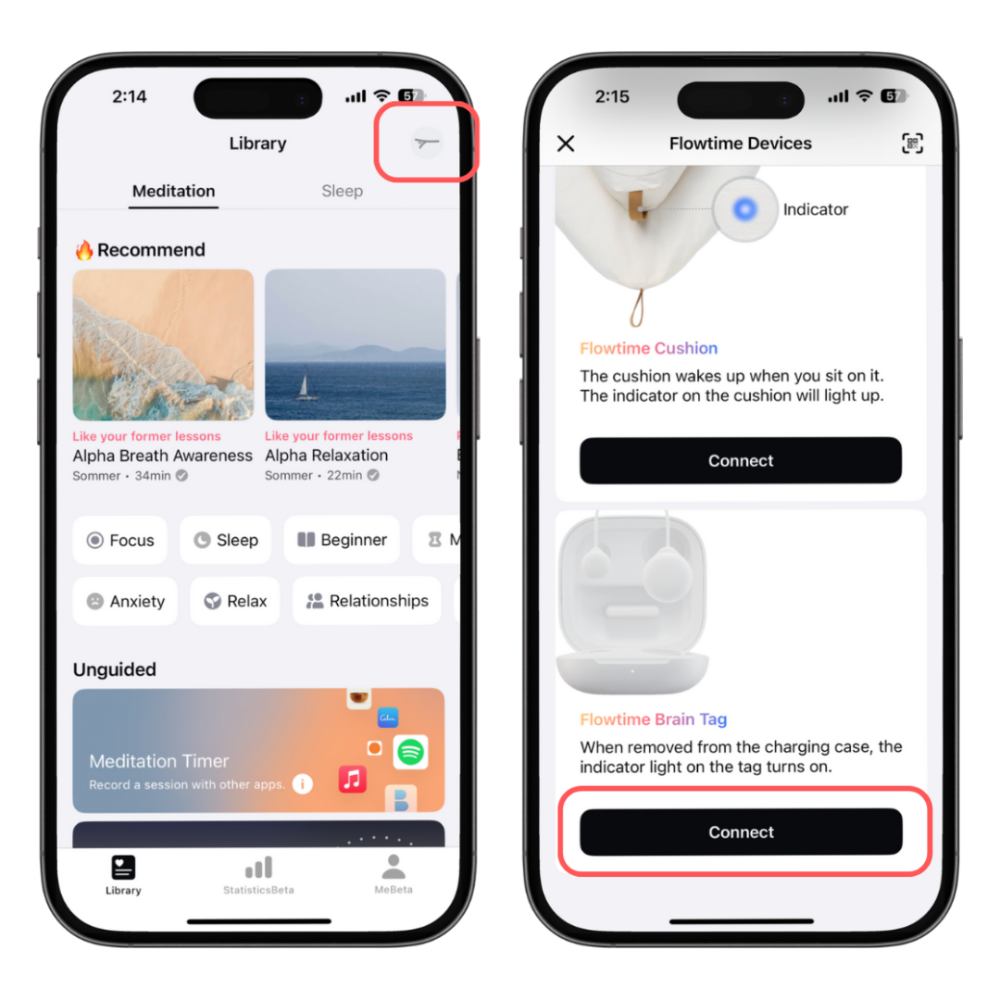

## How to Connect the Tag?

### For New Users
**Step 1: Download the Flowtime App and Sign Up**
Visit the App Store or Google Play, search for “Flowtime,” download the app, and create an account by following the on-screen instructions.

**Step 2: Prepare the Brain Tag for Pairing**
Open the charging case and gently remove the tag. The tag is now ready for pairing.

**Step 3: Open the Flowtime App**

•	Open the app on your phone. A new user setup guide will appear, which will walk you through connecting the tag with the app.
•	Once connected, the app will notify you with a message: “Connection Success” and the tag battery level.
•	After pairing, return to the home page to begin your session.

**Automatic Future Connections**
Once you’ve successfully connected the tag for the first time, the app will automatically find and connect to your tag whenever you remove it from the charging case and open the app.

### For Existing Flowtime App Users (with Other Flowtime Devices)

**Step 1: Open the Flowtime App**
Open the app on your phone.

**Step 2: Connect the Flowtime Brain Tag**

•	Tap the icon in the top right corner of the app.

•	Tap the “Connect” option for the Brain Tag from the device list. The app will begin searching for your tag and connect it.

**Step 3: Automatic Future Device Connection**

•	The next time you open the app, it will search for the most recently used device and connect to it automatically if it’s ready to pair.

•	If you wish to switch devices, simply tap the icon in the top right corner on the home page to choose the device you want to connect.

**Note**
1. Make sure Bluetooth is enabled on your phone.
2. Make sure the charging case is not flashing quickly after you put the tag back to the case. If yes, charge the case for 30 minites before connetion.

For tips on getting the best signal while you sleep, check out our [How to Have Good Signals During Sleep](./How_to_Have_Good_Signals_during_Sleep.md) guide.

If you have any questions or need help, head to the Flowtime app, tap "Me," and then "Contact Us." We’re always here to help!