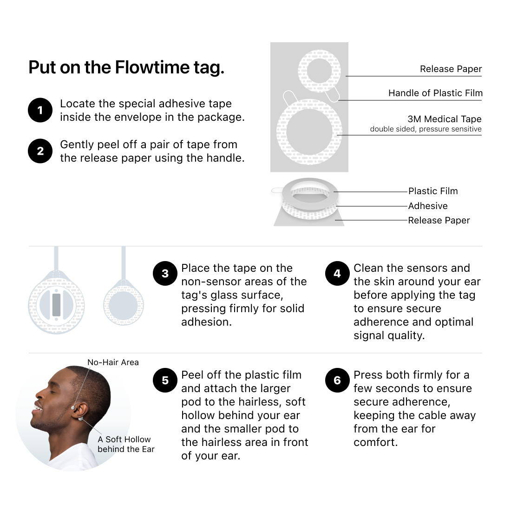

## How to Ensure Good Signal Quality During Sleep?

To make sure you're getting the most accurate sleep data, here's a simple guide to help you place your tag properly:

1. **Pick an Ear:**  
   You can stick the tag around either ear. If you have a side you like to sleep on, try sticking the tag on the opposite side so it doesn’t get squished.

2. **Clean the Skin:**  
   It’s a good idea to clean the skin around your ear with a wet tissue to remove any oils. This will help the sensors collect better signals.

3. **Prepare the Tag:**  
   Take the tag out of its case and make sure the cable between the two pods is straight and not twisted. This will ensure everything works properly.

4. **Find the Right Spot:**  
   Behind your ear, there's a little dent. Don’t place the big pod in the deepest part, as the sensors won’t make good contact with your skin. Instead, look for a soft, hairless, and flat spot to stick the big pod.

5. **Small Pod Placement:**  
   Stick the small pod in front of your ear. Just find a spot without hair that feels comfortable for you.

6. **Secure the Tape:**  
   When you apply the tape to the tag, press it firmly to make sure it’s stuck well. Once the tag is on your skin, hold it in place for at least 10 seconds to help it stay put. The tape gets stickier with pressure and warmth.

7. **Check Stability:**  
   Gently move your head around to make sure the tag is secure and not slipping.

8. **Check for Hair:**  
   Make sure there’s no hair between the sensors and your skin so you get the best signal.

9. **Avoid Bluetooth Interference:**  
   If possible, keep other Bluetooth devices away to avoid any interference with the tag.

10. **Keep Your Phone Close:**  
   Keep your phone within 1 meter of the tag for the best signal quality.

If you have any questions, please go to the Flowtime app, tap "Me," then "Contact Us" to let us know. We're here to help!