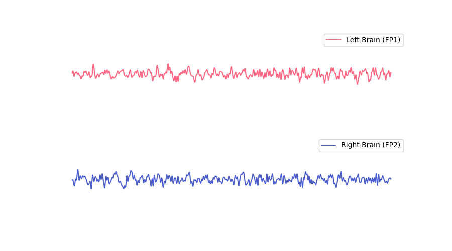
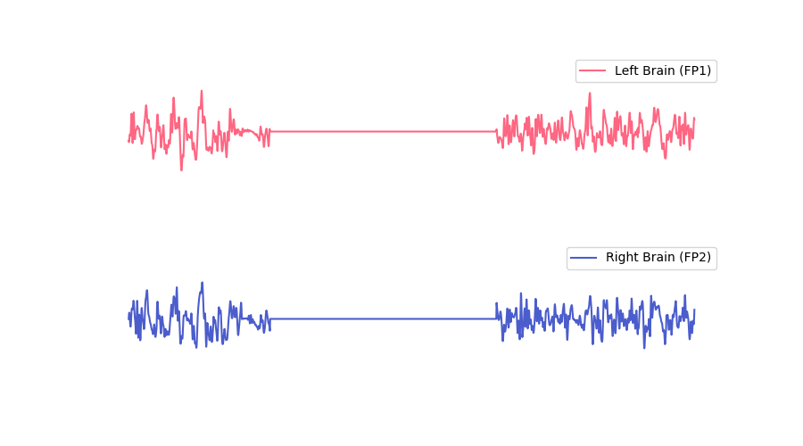
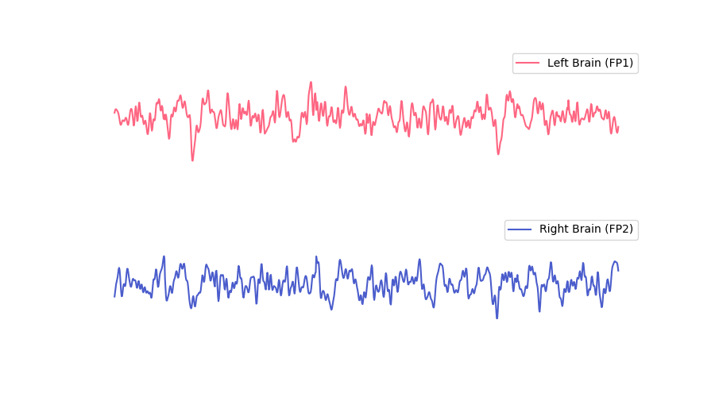

# 什么是脑电波（EEG）？

## 实时脑电波
脑电波是由大脑中大量神经细胞活动而产生的，在头皮表面可检测到这种微弱的电信号。脑电波的特征会随大脑状态而改变[^1]。

心流通过特殊的电极与芯片获取左前额与右前额的电信号，从中提取有效的脑电波。

## 脑电波波形

未佩戴设备或未检测到有效脑电波时，脑电波显示为一条直线。佩戴设备后，信号采集需要一段初始化时间。此期间噪声较大，可能导致脑电波显示不稳定，待初始化完成后会显示稳定的脑电波形。初始化的时间长短和皮肤状态有关，一般约为 30 秒 ~ 1 分钟，干燥的皮肤可能需要更长的时间。

:::info
为了获得更好的体验，实时脑电波保留了少量眼电信息，眨眼、眼动等小幅面部肌肉活动可在脑电波形上反映出来。咬牙等大幅面部肌肉活动可能对脑电信号造成过多干扰，导致无法检测到有效脑电波。
:::

---

**参考文献**

[^1]: Sanei, Saeid & Chambers, Jonathon. (2007). EEG signal processing. 10.1002/9780470511923. 

