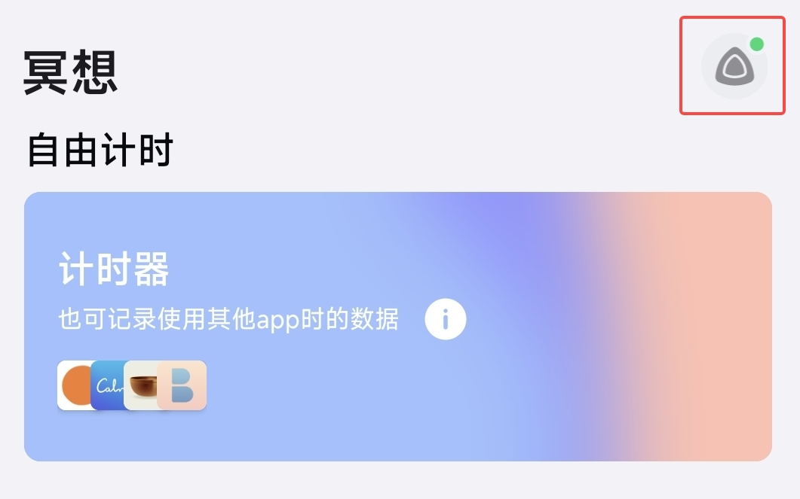
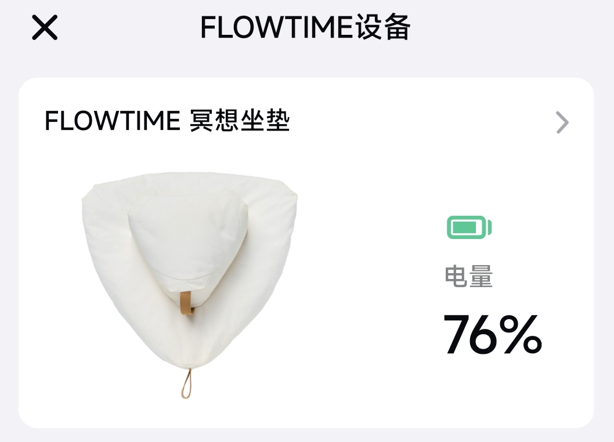

## 剩余电量和充电指南

### 如何了解电池状态？

**看指示灯颜色**

|指示灯 | 设备状态  |
|---|---|
| 红色 | 低电量 |
| 红色闪烁 | 正在充电 |
| 灯灭 | 电量充满 |

**通过应用查看**

在应用内打开首页，通过右上角设备图标进入设备页面查看电量。

### 充满电需要多长时间？

- 将附带的磁吸充电线从提手处伸进去，吸附到控制盒上。
- 充电线另一端连接电源适配器进行充电，普通手机电源适配器即可。
- 充电时指示灯为红灯闪烁，充满电大约需要 2 个小时，电满后指示灯熄灭。
- 充满电后，坐垫可连续使用 2000 小时。
- 正在充电时，坐垫会与应用断开连接。

