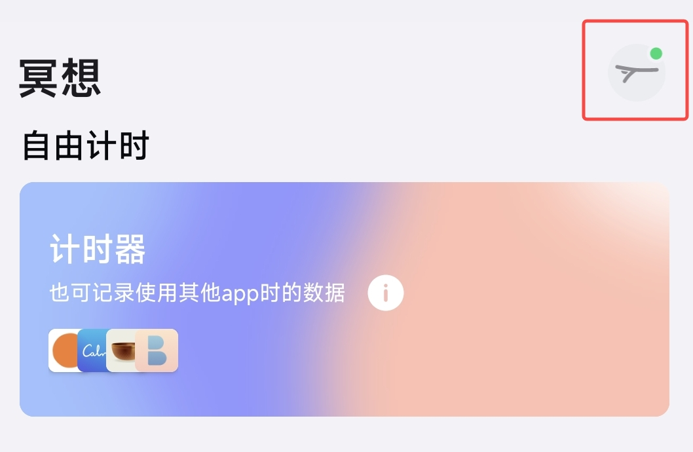
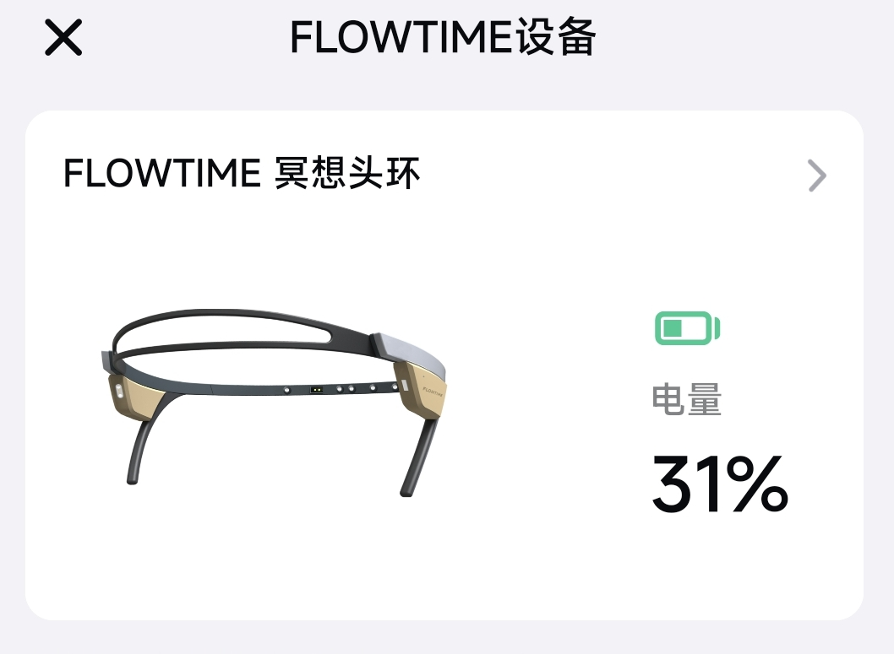

## 剩余电量和充电指南

### 如何了解电池状态？

#### 通过指示灯判断

|指示灯 | 设备状态  |
|---|---|
| 蓝灯 | 电量正常 |
| 红灯 | 电量低于 20%，电量不足 |
| 红灯呼吸灯 | 正在充电，但未充满 |
| 绿灯长亮| 正在充电，已充满|

#### 应用内查看

在应用内打开首页，通过右上角设备图标进入设备页面查看电量。

### 头环充满电需要多长时间？

- 用附赠充电线连接头环和电脑 USB 口或 USB 充电器，指示器将显示绿灯闪烁。
- 充满电大约需要 2 个小时，电满后指示灯将变成绿灯常亮。
- 充满电后，头环的续航时间为 8 小时左右。
- 正在充电时，头环将与应用断开连接。