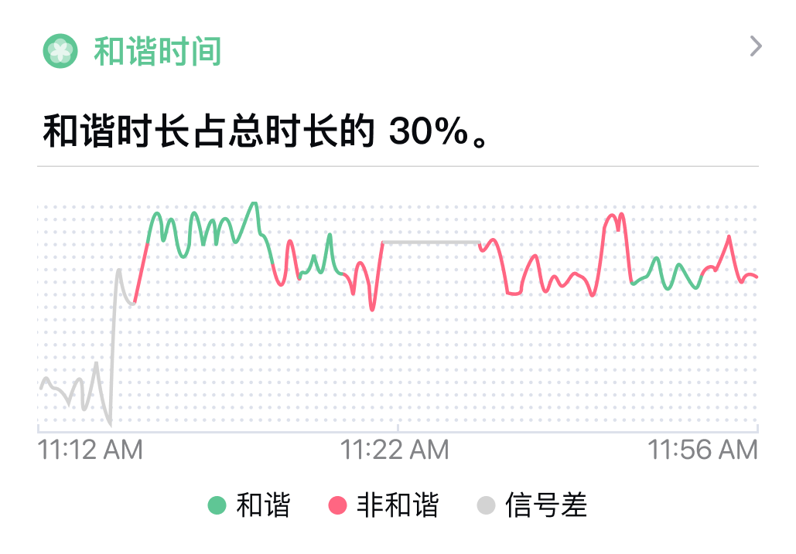
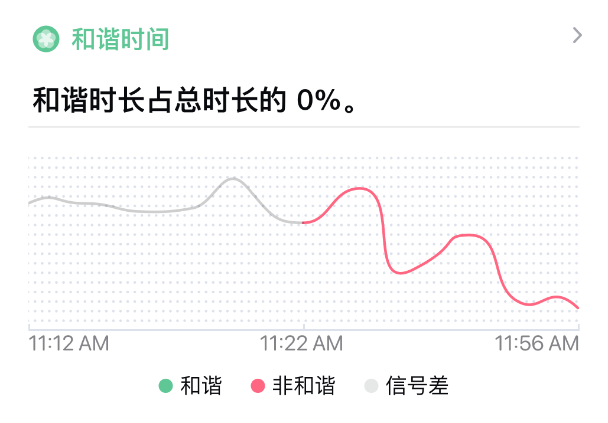
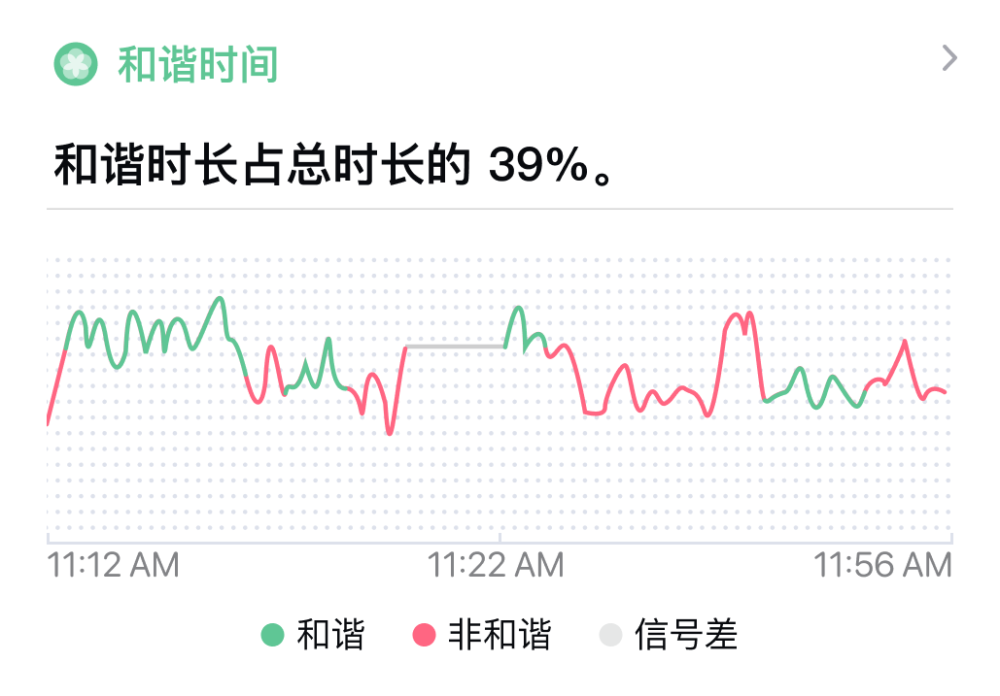
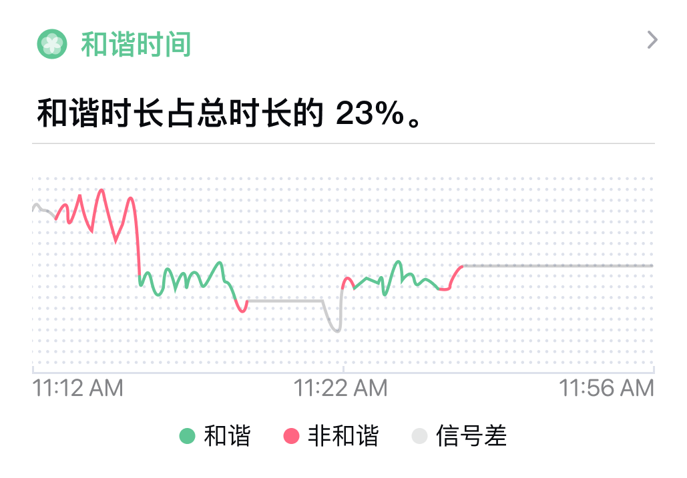

## 报表提示信息

### 信号质量差 {#poor-signal}
#### 坐垫信号质量差或者无数据

练习期间部分数据信号质量差。可能是因为坐垫没有坐下或者没有坐好。

1. 没有坐在坐垫上，传感器无法采集数据。无有效数据表现为练习中部分数据是**灰色的直线**。
2. 练习中身体大幅度的动作会让坐垫传感器无法和身体充分接触，导致信号质量不好。信号质量不好时显示灰色。

练习过程中，数据信号质量不好的时候会有声音和通知提示。可以根据提示调整坐姿，获得良好信号。生成的练习记录中，信号质量不好的数据会显示为灰色。

:::tip
* [点击链接了解信号质量不好时的实时提示。](/cushion-instructions/no-realtime-data)
* [点击链接了解如何正确使用坐垫。](/cushion-instructions/guide)
:::

#### 头环信号质量差或者无数据
练习期间部分数据信号质量差。可能是因为头环没有佩戴或者没有戴好。

1. 头环没有佩戴，传感器无法采集数据。无有效数据表现为练习中部分数据是**灰色的直线**。
2. 绑带太松，传感器未和皮肤充分接触，或者皮肤干燥等原因会导致信号质量不好。信号质量不好时显示灰色。

练习过程中，数据信号质量不好的时候会有声音和通知提示。可以根据提示调整坐姿，获得良好信号。生成的练习记录中，信号质量不好的数据会显示为灰色。

:::tip
* [点击链接了解信号质量不好时的实时提示。](/headband-instructions/no-realtime-data)
* [点击链接了解如何正确使用头环。](/headband-instructions/guide)
:::

### 设备断开连接 {#device-disconnected}

练习期间设备断开连接。可能是离得太远、有其他设备干扰或者设备电量低。

1. 手机和设备的距离最好不要超过 2 米。过远的距离可能导致蓝牙信号弱从而断开连接。
2. 如果周围有太多其他的蓝牙、WiFi 电子设备、路由器等，也可能导致设备断开连接。使用时可尽量远离他们。
3. 设备电量低也可能导致连接不稳定。请在提示低电量后，尽快充电，充电完成后再进行使用。

练习过程中，设备断开的时候会有声音和通知提示。可以根据提示重新连接设备。生成的练习记录中，设备断开后的数据会显示为灰色直线。

### 网络断开连接 {#network-disconnected}

练习期间网络断开连接。可能是网络信号不好或无网络。

心流时刻的数据分析需要网络支持，如果网络信号不好或者无网络将无法获取有效的数据分析。

练习过程中，网络断开的时候会有声音和通知提示。可以根据提示重新连接网络。生成的练习记录中，设备断开后的数据会显示为灰色直线。

:::info
如果到练习结束仍旧未连接网络，将会无法获取有效的数据分析，生成的冥想记录没有数据分析。
:::