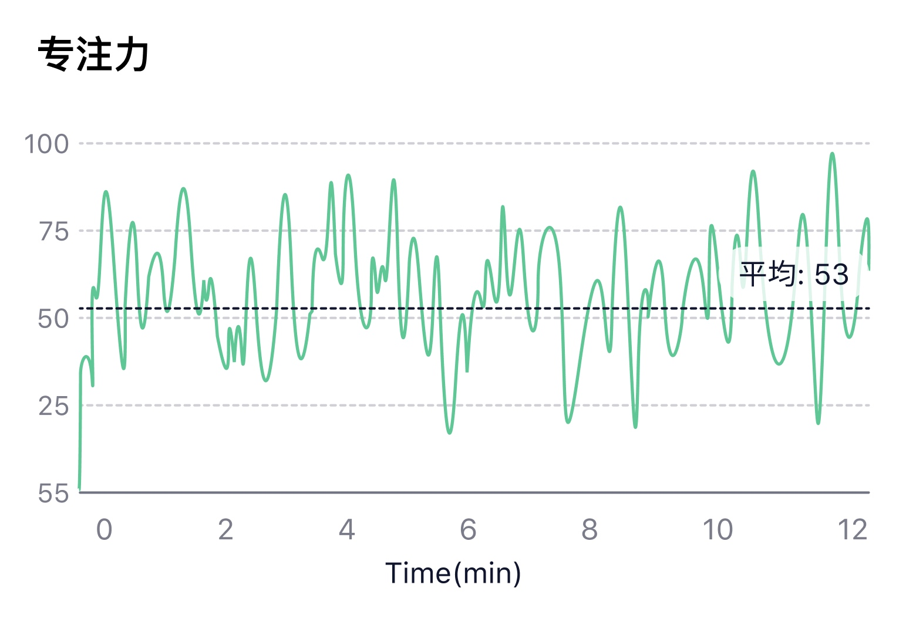
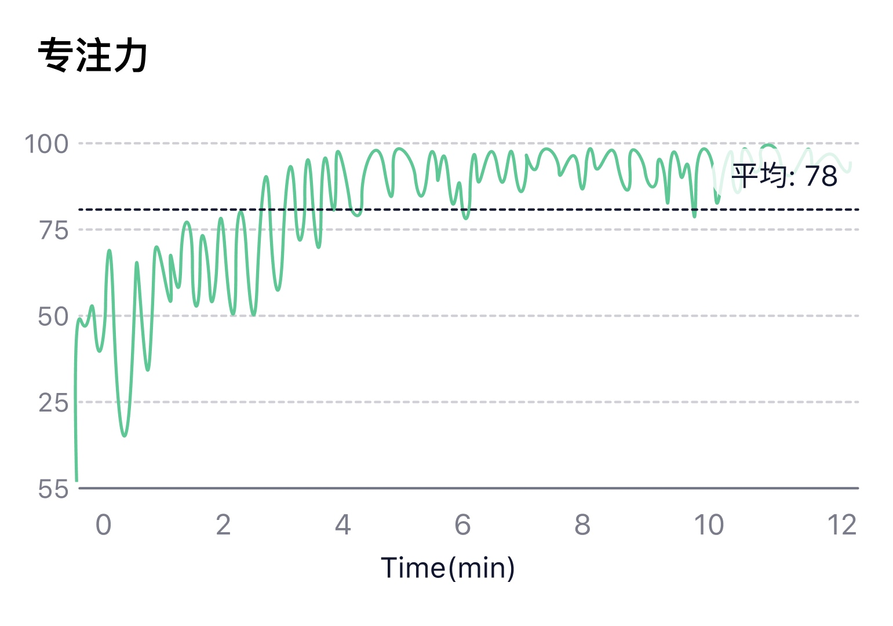
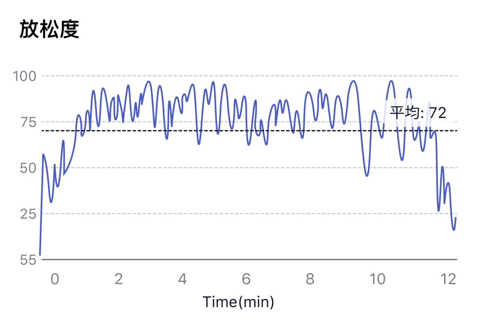
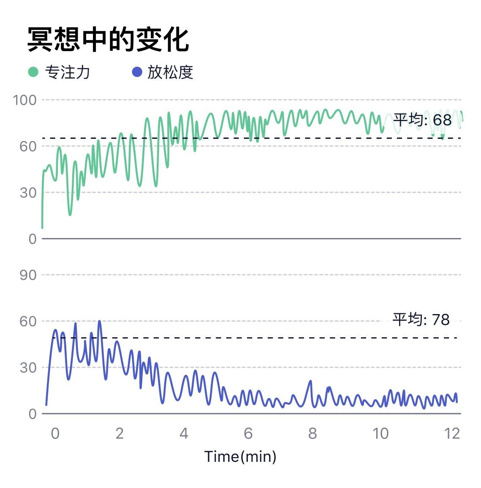
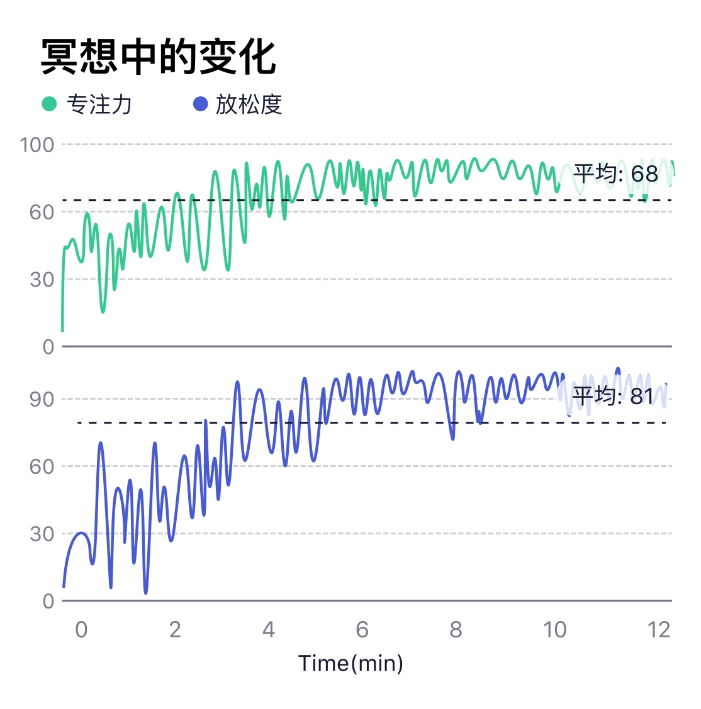

# 如何看注意力和放松度曲线？
## 冥想状态下的注意力

关于注意力，请查看[🎯注意力](../名词解释/注意力)。

大多数形式的冥想需要控制注意力，比如关注自己的呼吸，如果发现自己走神，需要把注意力唤回，重新保持对呼吸的关注，或者目不转睛盯住一个物体，控制自己的注意力。通过注意力指标可以反映冥想过程中的注意力变化趋势。

## 冥想状态下的放松度

关于放松度，请查看[🍀放松度](../名词解释/放松度)。

大多数形式的冥想都是大脑放松的过程。通过放松度指标可以反映冥想过程中的放松度变化趋势，一般在闭眼放松或进入冥想状态后，放松度会提高，经过放松训练可以提高放松度水平，使精神得到更快的恢复。

## 注意力与放松度结合查看

注意力监测模块与放松度监测模块结合能够更好地反映冥想的状态。

对于未经过长期冥想训练的人，特定状态下的脑电波频谱较为集中，在专注状态下放松度一般不高，而在放松状态下注意力一般较低，两者呈现出“互斥”的现象；而经过长期冥想训练的人，脑电波频谱分布更广阔而均匀，可以在大脑清醒放松的同时保持专注和觉醒的状态，在冥想过程中注意力和放松度均能维持在较高水平。这种状态下，由于大脑放松而专注，更容易迸发灵感，创造力较强。
 

