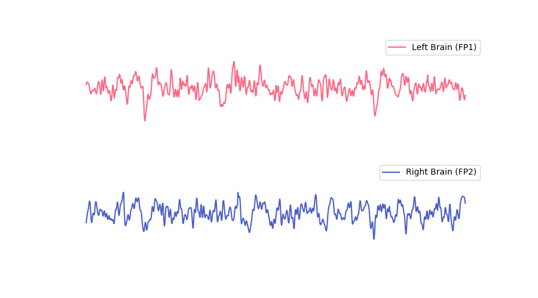

## 实时脑电波图

实时脑电波图显示了 5 秒内的左前额（Fp1）与右前额（Fp2）的脑电波波形。

未佩戴设备或未检测到有效脑电波时，脑电波显示为一条直线。佩戴设备后，信号采集需要一段初始化时间。此期间噪声较大，可能导致脑电波显示不稳定，待初始化完成后会显示稳定的脑电波形。初始化的时间长短和皮肤状态有关，一般约为 30 秒 ~ 1 分钟，干燥的皮肤可能需要更长的时间。

:::info
为了获得更好的体验，实时脑电波保留了少量眼电信息，眨眼、眼动等小幅面部肌肉活动可在脑电波形上反映出来。咬牙等大幅面部肌肉活动可能对脑电信号造成过多干扰，导致无法检测到有效脑电波。
:::

### 正常脑电波

### 受干扰的脑电波

### 眨眼或者眼动时的脑电波

