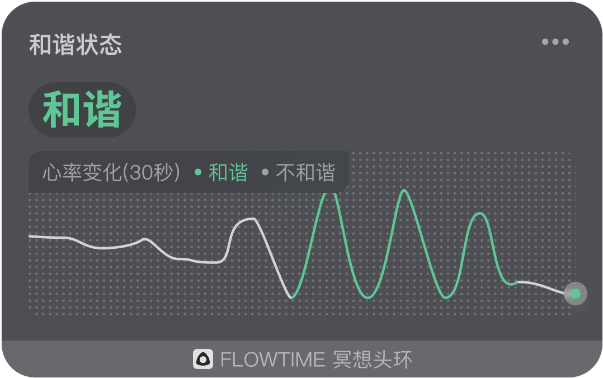

### 实时和谐状态图

实时和谐度图中的曲线显示了 30 秒内的和谐状态。左上角显示了当前的状态是否和谐，曲线为实时的心率变化曲线，曲线的颜色显示了和谐状态的时间段，和谐状态下的曲线为绿色，并且呈现规律的周期性，非和谐状态下的曲线为灰色。

未佩戴设备或未检测到有效心率时，和谐状态不显示。佩戴设备后，信号采集需要一段初始化时间，待初始化完成后会显示心率曲线并判断和谐状态。过程中如果由于干扰导致信号质量不佳，此时心率值可能在一段时间内保持不变，导致无法判断和谐状态，当信号重新稳定后恢复正常。

