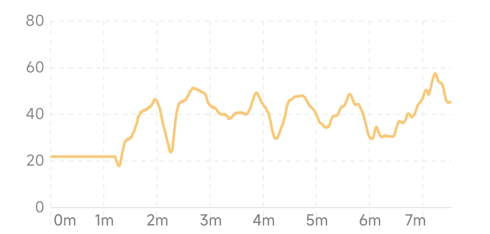
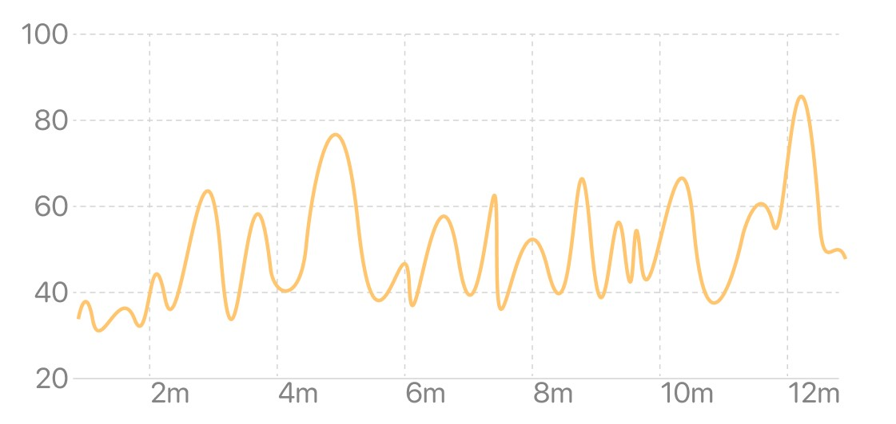
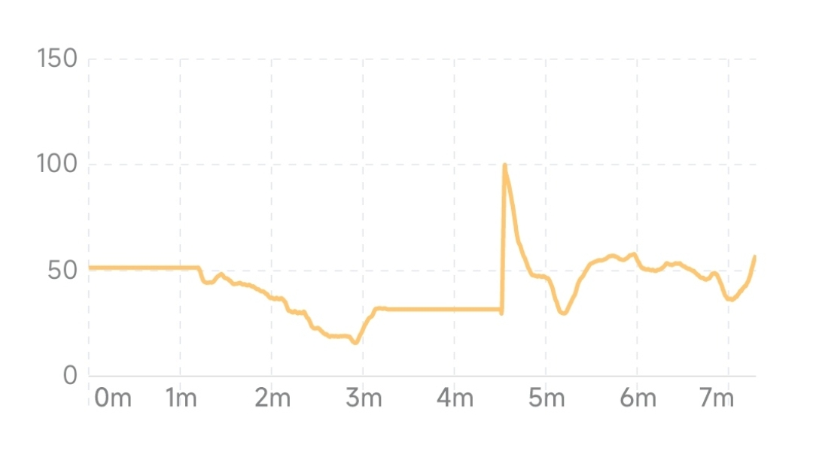

## 心率变异性（HRV）的变化曲线图

心率变异性的变化曲线图反映了 HRV 随时间的变化。横坐标为时间，纵坐标为 HRV 水平。曲线或柱形越高表示 HRV 水平越高。由于每个人的 HRV 基线水平不同，并且在不同状态下也可能有较大差别，因此在相似状态下测得的 HRV 长期变化趋势更有意义。

### 当次体验视图

当次体验视图反映了当次体验过程中 HRV 的变化趋势。心率与身体状态密切相关。在冥想过程中，HRV 随冥想状态的改变可能有所变化。一般在呼吸放松状态下 HRV 值较高。随着长期的冥想练习，HRV 的总体水平将有所提高。

:::info
有时由于体验过程中的运动、说话等可能导致短时间内心率出现较大起伏，使 HRV 曲线出现局部的高峰。这种状态与正常冥想时的状态不同，所以此时获得的较高的 HRV 值不具有比较的意义。
:::

#### 典型冥想状态下的 HRV 变化曲线

#### 冥想时进入状态后 HRV 升高并维持在较高状态

#### 由于干扰导致 HRV 曲线出现局部峰值

### 月视图

月视图反映了最近 1 个月 HRV 平均水平的变化趋势，横坐标为日期。柱状图中每个柱形的高度表示当天所有体验的 HRV 平均值。从月视图中可以看到 HRV 水平短期的变化趋势。

### 年视图

年视图反映了最近 1 年 HRV 平均水平的变化趋势，横坐标为月份。柱状图中每个柱形的高度表示当月每日 HRV 平均值的平均水平。从年视图中可以看到 HRV 水平长期的变化趋势。