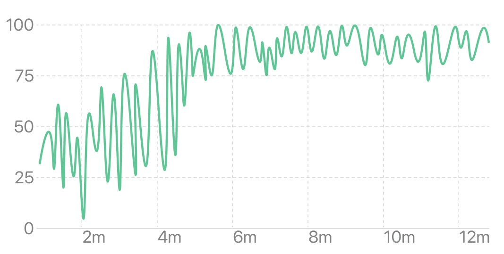

## 注意力变化趋势图

注意力变化趋势图反映了注意力随时间的变化。横坐标为时间，纵坐标为注意力水平。曲线或柱形越高表示越专注。

### 当次体验视图

当次体验视图反映了当次体验过程中实时注意力的变化趋势。一些类型的冥想需要控制注意力，保持大脑的活跃或高度觉醒。没有经过长期训练的人注意力难以在高水平维持较长时间，一般表现为忽高忽低。经过长期专注训练的人士在冥想中可以使注意力达到很高水平并维持较长时间。在一些以放松为主的冥想中，由于大脑活跃度降低，可能导致注意力水平较低。

典型冥想过程中的注意力变化（注意力水平时高时低）

经过长期专注训练的冥想注意力变化（持续上升且维持高水平）

以放松为主的冥想中的注意力变化（注意力水平下降且维持低水平）

### 月视图

月视图反映了最近 1 个月注意力平均水平的变化趋势，横坐标为日期。柱状图中每个柱形的高度表示当天所有体验的注意力平均值。从月视图中可以看到注意力水平短期的变化趋势。

### 年视图

年视图反映了最近 1 年注意力平均水平的变化趋势，横坐标为月份。柱状图中每个柱形的高度表示当月每日注意力平均值的平均水平。从年视图中可以看到注意力水平长期的变化趋势。

