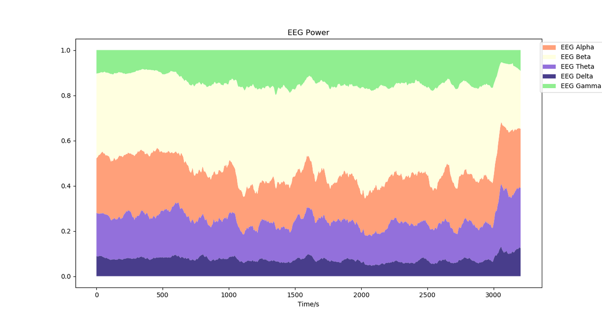
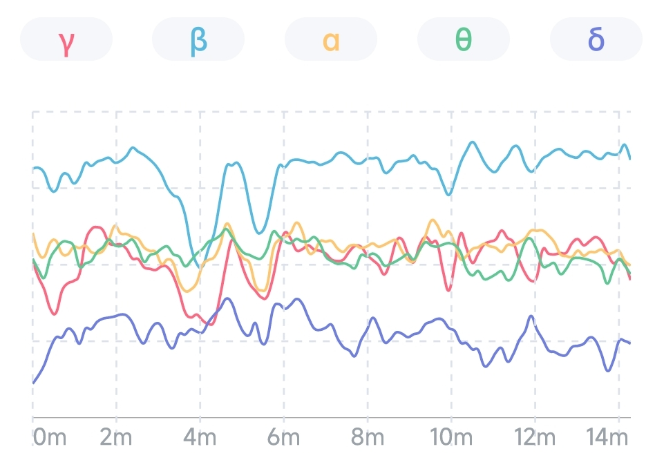

## 脑电波节律占比趋势图

脑电波节律占比趋势图反映了 5 种脑电波节律之间的比例关系随时间的变化。横坐标为时间，纵坐标为 5 种脑电波节律的占比。图中每一种色块的纵向宽度表示了这种脑电波节律的占比，色块越宽表示这种脑电波节律占比越高，5 种脑电波节律占比的总和为 100%。

### 当次体验视图

当次体验视图反映了当次体验过程中 5 种脑电波节律之间的比例关系的变化趋势。例如下图是一个冥想过程中的脑电波节律占比趋势图，可以看出在冥想开始 10 分钟之后，γ 波和 β 波的占比显著上升，而 α 波和 θ 波的占比有所下降，这表示专注和觉醒程度的提高，而在冥想结束前，各脑电波节律恢复到正常水平，表示专注和觉醒状态的结束。

### 月视图

月视图反映了最近 1 个月 5 种脑电波节律之间的比例关系的变化趋势，横坐标为日期。从月视图中可以看到每天 5 种脑电波节律的平均占比，以及 5 种脑电波短期的变化趋势。

### 年视图

年视图反映了最近 1 年 5 种脑电波节律之间的比例关系的变化趋势，横坐标为月份。从年视图中可以看到每个月 5 种脑电波节律的平均占比，以及 5 种脑电波长期的变化趋势。

## 脑电波节律能量趋势图

脑电波节律能量趋势图反映了当次体验中 5 种脑电波节律能量绝对值随时间的变化。横坐标为时间，纵坐标为 5 种脑电波节律的绝对能量。图中每一条曲线的高度表示了这种脑电波节律的能量，曲线越高表示这种脑电波节律能量越高。

例如下图是一个冥想过程中的脑电波节律能量趋势图，可以看出在冥想过程中，前半段所有脑电波节律能量缓慢上升，后半段 γ 波和 β 波的能量显著上升，而 α 波、 θ 波和 δ 波的能量有所下降，这表示后半段专注和觉醒程度的提高。

