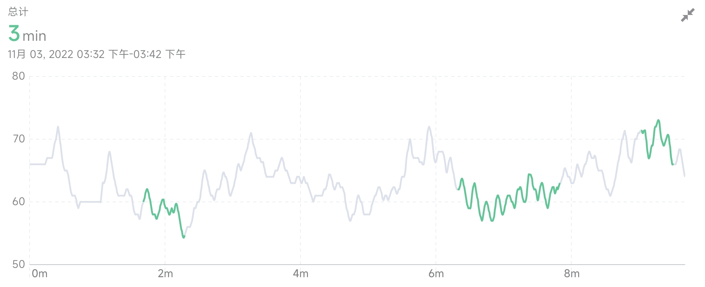

## 共振呼吸
我们都在呼吸，但不是每个人都会呼吸。研究发现，有90%的人都以错误的方式呼吸，进而导致了一系列慢性疾病的产生或者加剧。有意识地改变呼吸方法，可以改变我们的肺活量和肺功能，降低血压，增强免疫系统，平衡神经系统。

正常呼吸频率为每分钟12-20次，在这个呼吸频率下，吸入的气体并没有完全参与肺泡通气，它们残留在气道当中，被称作无效腔气量。慢而深的呼吸可以促进经肺泡的气体交换，从而提高了血氧含量，进而提高了包括大脑在内全身各器官和组织的供氧。

深慢呼吸有多种模式，「共振呼吸」是其中被广泛研究的一种。

心率与血压之间会相互调控，构成一个闭环回路，这个回路的周期大约为 10 秒。

当你吸气5秒，呼气5秒时，构成了一个10秒的呼吸周期，它与心率和血压的回路产生了同频共振，这样的呼吸方式称为「共振呼吸」。

研究表明，共振呼吸可以显著缓解焦虑、抑郁、愤怒等负面情绪，还能提高创造力和运动表现[^1-2]。慢性疼痛、哮喘、高血压前期的患者，可以通过练习共振呼吸改善症状[^3-5]。

App中的「呼吸引导」模式通过声音、图像和振动引导你进行共振呼吸训练。

当你稳定、规律地共振呼吸时，心率会随之呈现出规律、高度有序的变化，进入「和谐时刻」。「和谐时刻」是一种认知增强、充满活力的平静状态。如果呼吸的稳定性不够，就不容易进入「和谐时刻」，但可以通过坚持呼吸训练得到改善。

[^1]Lehrer P, Kaur K, Sharma A, Shah K, Huseby R, Bhavsar J, Sgobba P, Zhang Y. Heart Rate Variability Biofeedback Improves Emotional and Physical Health and Performance: A Systematic Review and Meta Analysis. Appl Psychophysiol Biofeedback. 2020 Sep;45(3):109-129. doi: 10.1007/s10484-020-09466-z. Erratum in: Appl Psychophysiol Biofeedback. 2021 Dec;46(4):389. PMID: 32385728.

[^2]Jiménez Morgan, S., Molina Mora, J.A. Effect of Heart Rate Variability Biofeedback on Sport Performance, a Systematic Review. Apple Psychophysiology Biofeedback 42, 235–245 (2017). https://doi.org/10.1007/s10484-017-9364-2

[^3]Schmidt, J.E., Joyner, M.J., Carlson, C.R. et al. Cardiac Autonomic Function Associated with Treatment Adherence After a Brief Intervention in Patients with Chronic Pain. Appl Psychophysiol Biofeedback 38, 193–201 (2013). https://doi.org/10.1007/s10484-013-9222-9

[^4]Lehrer PM, Vaschillo E, Vaschillo B, Lu SE, Scardella A, Siddique M, Habib RH. Biofeedback treatment for asthma. Chest. 2004 Aug;126(2):352-61. doi: 10.1378/chest.126.2.352. PMID: 15302717.

[^5]Chen, S., Sun, P., Wang, S. et al. Effects of heart rate variability biofeedback on cardiovascular responses and autonomic sympathovagal modulation following stressor tasks in prehypertensives. J Hum Hypertens 30, 105–111 (2016). https://doi.org/10.1038/jhh.2015.27
## 和谐时间统计图
和谐时间统计图记录了和谐状态累计时长的变化趋势。

### 当次体验视图

当次体验视图记录了当次体验过程中的和谐状态时间段。左上角显示了当次体验的和谐状态总时长。曲线图为当次体验的实时心率变化趋势，横坐标为时间，纵坐标为心率。曲线的颜色显示了和谐状态的时间段，和谐状态的时间段为绿色曲线，非和谐状态的时间段为灰色曲线。

冥想过程中的呼吸模式会影响心率变化的模式。心率变化曲线可以直观反映冥想过程中的和谐状态。一般状态下心率的变化呈现无序性，通过共振呼吸（吸气5秒，呼气5秒）可以使心率呈现周期性节律，达到心-脑和谐的状态。长期的呼吸训练可以使身体更容易进入和谐状态并维持较长时间，从而获得更长的和谐时间和更高的和谐占比。

#### 心率曲线与和谐状态（灰色部分心率无序变化，绿色部分通过有规律的深呼吸达到和谐状态）

#### 有经验的冥想者在呼吸练习中的心率与和谐状态（连续长时间和谐)

#### 月视图

月视图反映了最近 1 个月和谐时间的变化趋势，横坐标为日期。柱状图中每个柱形的高度表示当天所有体验的和谐时间总和。从月视图中可以看到和谐时间短期的变化趋势。

#### 年视图

年视图反映了最近 1 年和谐时间的变化趋势，横坐标为月份。柱状图中每个柱形的高度表示当月所有体验的和谐时间总和。从年视图中可以看到和谐时间长期的变化趋势。

